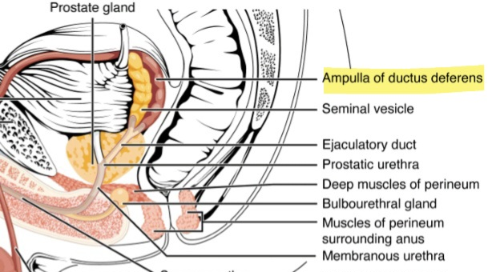
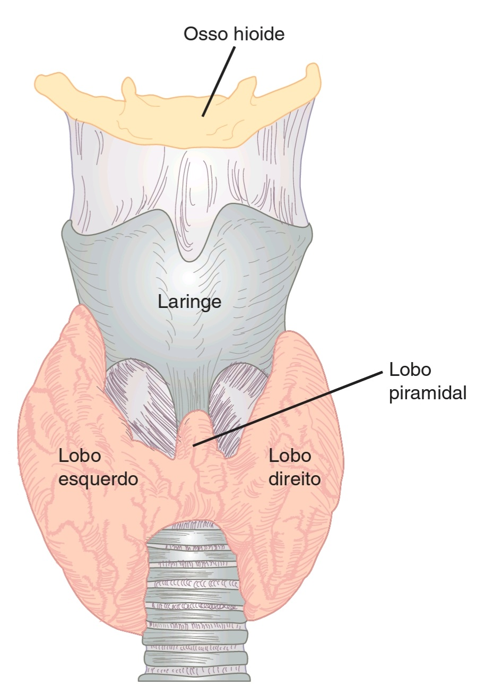

## RESUMÃO DA SEGUNDA PI

## Sumário 

- [Anatomia do sistema reprodutor](#anatomia-do-sistema-reprodutor)
  * [ANATOMIA DO SISTEMA REPRODUTOR TESTICULAR](#anatomia-do-sistema-reprodutor-testicular)
  * [O escroto](#o-escroto)
  * [O testículo](#o-testiculo)
  * [As vesículas seminais](#as-vesiculas-seminais)
  * [A próstata](#a-prostata)
    + [A URETRA PROSTÁTICA](#a-uretra-prostatica)
  * [As glândulas bulbouretrais](#as-glandulas-bulbouretrais)
  * [O pênis](#o-penis)
  * [Músculos acessórios da ejaculação](#musculos-acessorios-da-ejaculacao)
  * [O SISTEMA REPRODUTOR FEMININO](#o-sistema-reprodutor-feminino)
  * [Os grandes lábios](#os-grandes-labios)
  * [O vestíbulo](#o-vestibulo)
  * [O clitóris](#o-clitoris)
  * [A vagina](#a-vagina)
  * [O útero](#o-utero)
  * [O ovário](#o-ovario)
  * [As tubas uterinas](#as-tubas-uterinas)
- [O sistema endócrino](#o-sistema-endocrino)
  * [MECANISMOS INTRACELULARES DO EFEITO HORMONAL](#mecanismos-intracelulares-do-efeito-hormonal)
  * [METABOLISMO DA GLICOSE](#metabolismo-da-glicose)
  * [O estado fisiológico do diabético e do pré-diabético](#o-estado-fisiologico-do-diabetico-e-do-pre-diabetico)
  * [As manifestações clínicas da diabetes](#as-manifestacoes-clinicas-da-diabetes)
  * [A diabetes descompensada](#a-diabetes-descompensada)
  * [Os diferentes transportadores de glicose do organismo](#os-diferentes-transportadores-de-glicose-do-organismo)
  * [O efeito do estresse na glicemia](#o-efeito-do-estresse-na-glicemia)
  * [O mecanismo diabetogênico do GH](#o-mecanismo-diabetogenico-do-gh)
  * [METABOLISMO DO CÁLCIO](#metabolismo-do-calcio)
  * [O paratormônio e a calcitonina](#o-paratormonio-e-a-calcitonina)
  * [A vitamina D](#a-vitamina-d)
  * [Manifestações clínicas da hipocalcemia](#manifestacoes-clinicas-da-hipocalcemia)
  * [A TIREÓIDE](#a-tireoide)
  * [Os hormônios tireoideanos e seus efeitos](#os-hormonios-tireoideanos-e-seus-efeitos)
  * [A produção dos hormônios tireoideanos](#a-producao-dos-hormonios-tireoideanos)
  * [O hipertireoidismo](#o-hipertireoidismo)
    + [TRÍADE DIAGNÓSTICA](#triade-diagnostica)
    + [CAUSA FISIOLÓGICA](#causa-fisiologica)
  * [Hipotireoidismo](#hipotireoidismo)
    + [TRÍADE DIAGNÓSTICA](#triade-diagnostica-1)
    + [CAUSA FISIOLÓGICA](#causa-fisiologica-1)
  * [A HIPÓFISE](#a-hipofise)
  * [A adenohipófise](#a-adenohipofise)
    + [LINHAGEM DA ECTODERMA ORAL](#linhagem-da-ectoderma-oral)
    + [LINHAGEM DA NEUROECTODERMA](#linhagem-da-neuroectoderma)
  * [A neurohipófise](#a-neurohipofise)
  * [As suprarrenais](#as-suprarrenais)
  * [O pâncreas](#o-pancreas)
  * [O ciclo hormonal feminino](#o-ciclo-hormonal-feminino)
    + [As fases do ciclo menstrual](#as-fases-do-ciclo-menstrual)
- [O sistema digestivo](#o-sistema-digestivo)
  * [A REGIÃO ORAL](#a-regiao-oral)
  * [A língua](#a-lingua)
  * [O dente](#o-dente)
  * [O ESÔFAGO](#o-esofago)
  * [O ESTÔMAGO](#o-estomago)
  * [O INTESTINO DELGADO](#o-intestino-delgado)
    + [O duodeno](#o-duodeno)
  * [O INTESTINO GROSSO](#o-intestino-grosso)
  * [Aspectos gerais](#aspectos-gerais)
  * [Os mesentérios e as tênias cólicas](#os-mesenterios-e-as-tenias-colicas)
  * [A MOTILIDADE GERAL DO SISTEMA DIGESTIVO](#a-motilidade-geral-do-sistema-digestivo)
  * [VASCULARIZAÇÃO DO SISTEMA DIGESTIVO](#vascularizacao-do-sistema-digestivo)
  * [Vascularização das vísceras abdominais](#vascularizacao-das-visceras-abdominais)
  * [Vascularização do fígado](#vascularizacao-do-figado)
  * [HISTOLOGIA DO SISTEMA GASTROINTESTINAL](#histologia-do-sistema-gastrointestinal)
  * [Os epitélio predominantes do trato digestivo](#os-epitelio-predominantes-do-trato-digestivo)
    + [EPITÉLIO PAVIMENTOSO ESTRATIFICADO NÃO-QUERATINIZADO](#epitelio-pavimentoso-estratificado-nao-queratinizado)
  * [EPITÉLIO SIMPLES COLUNAR NÃO-CILIADO](#epitelio-simples-colunar-nao-ciliado)
  * [EPITÉLIO CÚBICO ESTRATIFICADO](#epitelio-cubico-estratificado)
  * [Aprofundamento sobre a histologia de órgãos específicos](#aprofundamento-sobre-a-histologia-de-orgaos-especificos)
    + [HISTOLOGIA DA LÍNGUA](#histologia-da-lingua)
    + [As papilas gustativas](#as-papilas-gustativas)
    + [HISTOLOGIA DAS GLÂNDULAS SALIVARES](#histologia-das-glandulas-salivares)
    + [HISTOLOGIA DO INTESTINO](#histologia-do-intestino)
    + [As camadas do intestino](#as-camadas-do-intestino)
      - [O EPITÉLIO INTESTINAL](#o-epitelio-intestinal)
    + [Adaptações absorptivas do intestino](#adaptacoes-absorptivas-do-intestino)
  * [BIOQUÍMICA DO SISTEMA DIGESTIVO](#bioquimica-do-sistema-digestivo)
  * [Indicadores laboratoriais da função hepática](#indicadores-laboratoriais-da-funcao-hepatica)
  * [Metabolismo da bilirrubina](#metabolismo-da-bilirrubina)
  * [Metabolismo de carboidratos](#metabolismo-de-carboidratos)
    + [DIGESTÃO DOS CARBOIDRATOS](#digestao-dos-carboidratos)
    + [ABSORÇÃO DOS CARBOIDRATOS](#absorcao-dos-carboidratos)
  * [As fibras alimentares](#as-fibras-alimentares)
  * [A absorção dos lipídeos](#a-absorcao-dos-lipideos) 

## Anatomia do sistema reprodutor 

> O 🅟 logo após uma frase ou um parágrafo indica que aquela informação já caiu em prova

### ANATOMIA DO SISTEMA REPRODUTOR TESTICULAR 

### O escroto

Os testículos estão localizados em um saco muscular denominado “escroto” que fica posteriormente ao pênis. Esse saco é recoberto por uma camada de pele altamente pigmentada sobre a qual é possível observar um espessamento mediano chamado **rafe escrotal** (rafe = do grego, _“costura”_).

Quanto à camada muscular em si, essa é formada por dois músculos: **o dartos e o cremaster**.

O dartos, ou “túnica dartos”, é um músculo liso subcutâneo do escroto que também compõe o **septo escrotal**, estrutura que divide o saco em dois compartimentos.

Já quanto ao cremaster, suas fibras descendem do músculo oblíquo interno 🅟 e abraçam os testículos e o cordão espermático como uma rede. 

Quando ambos os músculos se contraem, o testículo é elevado para mais próximo ao corpo, o que é útil para mantê-lo aquecido durante dias frios. Isso se deve tanto à condução do calor corporal quanto à diminuição da área de superfície dessa estrutura (o que reduz o contato do escroto com o ar frio do ambiente).

> **CORRELAÇÃO CLÍNICA:** CRIPTORQUIDIA
>
> Em condições normais, os testículos se desenvolvem interiormente ao corpo do feto e só migram para a bolsa escrotal entre a 28ª e a 40ª semana de gestação. Quando isso não ocorre, o que é comum especialmente em bebês prematuros, essa condição é denominada “criptorquidia”.
>
>  

### O testículo 

“Testículo” é o nome dado a cada uma das **gônadas** (órgãos reprodutivos) masculinos.

Ele é coberto por duas camadas distintas de tecido conjuntivo: a **túnica vaginal** (vagina = do latim, _“bainha”_) e a **túnica albugínea** (albus = do latim, _“branco”_).

> **MACETE:** O que é branco 💦 vai por dentro
> 
> Albugínea --> interna
> 
> Vaginal --> externa 

A primeira é uma membrana serosa, com faces parietal e visceral. A segunda é um filme de tecido conjuntivo branco recobrindo o testículo em si.

> **CORRELAÇÃO CLÍNICA:** CACHUMBA
>
> Uma das razões pela qual a inflamação dos testículos (_orquite_) causada pela cachumba é tão dolorosa relaciona-se com a _inelasticidade da túnica albugínea que recobre o testículo_, já que o órgão tende a inchar devido ao processo inflamatório sem, contudo, poder expandir além dos limítes dessa estrutura.

É por meio de invaginações da túnica albugínea que são formados os mais de 400 **septos** que dividem o testículo em inúmeros **lóbulos**.

São nos lóbulos onde se organizam os **túbulos seminíferos**, dentro dos quais as células reprodutoras masculinas se desenvolvem.

É também no interstício desses túbulos em que se encontram as células de Leydig, responsáveis por liberar a testosterona.

> **MACETE:** “Semilobos 🐕 de sete em sete 7️⃣”
>
> _Seminíferos_ ficam nos _lóbulos_ divididos em _septos_

Ao sair dos túbulos seminíferos, essas células passam pelos **túbulos retos** e em seguida pela **rete testes** (*literalmente*  “rede testicular”), por onde elas atravessam a túnica albugínea através dos **dutos eferentes** 🅟

> **MACETE:** “Se menino correto 😇 perde o porrete 🍆, fica carente 🥺”
>
> “Se menino” = seminífero
> 
> “...correto” = túbulo reto
>
> “...porrete” = rete testis
>
> “...carente” = dutos eferentes

Os dutos eferentes são a passagem que leva os espermatozoides recém-formados do testículo até o **epidídimo**, onde ocorrerá a maturação.

Tal estrutura é um tubo encolhido, situado póstero-lateralmente ao testículo, pela qual os espermatozoides entram na cabeça (A) e saem pelos **tubo deferente** (D) contínuos à cauda (C).

Lá os espermatozoides trafegam, inicialmente, devido ao movimento dos músculos lisos do tubo, mas, eventualmente, adquirem a habilidade de mover-se sozinhos, a qual será útil para explorar o trato reprodutor femino e possibilitar a fecundação.

Já a respeito do tubo deferente, esse apresenta-se dentro do escroto envolvido por camadas de tecido conjuntivo, vasos e nervos que, juntos, formam o **cordão espermático**.

O papel desse duto é de, no momento da ejaculação, ejetar os espermatozóides (com o auxílio de suas paredes musculares) para fora do escroto, através do **canal inguinal** e, eventualmente, para uma estrutura denominada **ampola** localizada posteriormente à bexiga (que nada mais é do que uma dilatação do próprio tubo).

> **CORRELAÇÃO CLÍNICA:** VASECTOMIA
>
> A vasectomia, uma das ferramentas acessíveis ao homem para o planejamento familiar, consiste na secção ou no selamento dos dutos deferentes (também chamados de *vasos* deferentes). Esse procedimento interrompe a saída dos espermatozóides do sistema testicular e impossibilita que eles componham o líquido seminal.

Além do dutos deferente, o cordão espermático também abriga estruturas fundamentais para a fisiologia testicular.

A principal delas é a **artéria testicular**, que é acompanhada no seu comprimento por um plexo venoso denominado **plexo pampiniforme**  (pampini = do latim, “gavinha; folha que se enrola”).

Não se restringindo ao retorno venoso, esse plexo também tem uma função essencial quanto ao controle da temperatura testicular. Isso ocorre, pois o sangue venoso ascendente forma um **sistema de contracorrente** com o sangue arterial que está descendo. A proximidade das duas correntes faz com que o calor passe da via arterial para a venosa e o sangue abdominal chegue mais frio aos testículos, matendo, assim, a temperatura ótima para a espermatogênese.

Apesar dos espermatozóides constituírem a parte mais importante do sêmen, eles só compõem 5% do líquido. O restante é composto pelas três glândulas acessórias do sistema reprodutor masculino: as **vesículas seminais**, a **próstata** e as **glândulas bulbouretrais**.

### As vesículas seminais

Quando os espermatozóides passam pela ampoula no momento da ejaculação, eles se misturam com um fluido rico em **frutose** liberado pelas **vesículas seminais**. Essa mistura servirá como substrato energético para os espermatozóides no caminho até a inseminação.

Após a ampoula, o tubo deferente e o da vesícula seminal se fundem para formar o **ducto ejaculatório**.

> **MACETE:** “Amparados sem mingau na porta do refeitório”
>
> Ampoula + seminal = ejaculatório 

O par de dutos ejaculatórios transportam a nova mistura para uma estrutura ímpar: a próstata.

### A próstata 

A próstata é uma glândula central localizada anteriormente ao reto e inferiormente à bexiga urinária, circundando a **uretra prostática** (a parte da uretra que passa por dentro da próstata).

Ela é responsável por acrescentar ao sêmen uma substância alcalina, o que vai ajudar o líquido a coagular (endurecer) e manter sua consistência dentro do trato feminino.

#### A URETRA PROSTÁTICA 

A parte prostática da uretra tem 3 a 4 cm de comprimento e atravessa a glândula na sua parte central e mais anterior.

É a parte da uretra mais intimamente relacionada ao sistema reprodutor, pois, na sua parede posterior, encontra-se uma crista mediana, a **crista uretral**, que se projeta no lúmen como uma elevação visível na secção transversal. 

De cada lado da crista existe uma depressão rasa, o **seio prostático**, cujo assoalho é perfurado pelos orifícios de 15-20 **ductos prostáticos**. Uma elevação, o **colículo seminal**, é observada aproximadamente na metade do comprimento da crista uretral.

Atravessando pelo colículo, pode ser observado o orifício em forma de fenda do **utrículo prostático** (também chamado de “vagina masculina”, por ter origem embrionária homóloga ao útero e à vagina; utrículo = _do latim_, “pequeno útero). Em ambos os lados deste orifício, ou exatamente dentro deste, estão as duas pequenas aberturas dos **ductos ejaculatórios** 🅟

Essas duas estruturas funcionam em uníssono, pois é com a contração do utrículo que os ductos se abrem e permitem a passagem do sêmen.

> **CAIU EM PROVA!**
> 
> “O utrículo está localizado:”
>
> A) No sulco bálamo-prepucial.
>
> B) Na fossa navicular da uretra esponjosa.
> 
> C) No colículo seminal.
>
> D) Na cabeça do epidídimo.
>
> E) No trígono vesical.
>
> GABARITO: 87 - (7 x 12)
> 
> ➊➋➌➍➎ = 🅐🅑🅒🅓🅔

### As glândulas bulbouretrais

Também chamadas de **glândulas de Cowper**, são elas que produzem o líquido pré-seminal, cuja função é lubrificar a uretra antes da ejaculação.

Note que ela fica aderida firmemente à base do pênis (bulbo) e entre as fibras do **músculo transverso profundo do períneo**.

### O pênis 

O pênis é composto por três câmaras de tecido erétil em formato de coluna.

As duas câmaras maiores laterais são os **corpos cavernosos**. Eles são os que de fato  constituem a maior parte do volume do pênis.

Porém, há ainda uma coluna ímpar que circunda a uretra e que pode ser sentida da superfície anterior do pênis: o **corpo esponjoso**.

> **MACETE:**
> 
> Mais perto do líquido 💦 --> esponja 🧽
> 
> Corpo esponjoso --> envolve o canal do líquido (uretra)
> 
> O mais externo -->  fica em contato com a “caverna” 🕳️
> 
> Corpo cavernoso --> mais perto das paredes do canal vaginal (durante a penetração)

Por fim, há ainda a **glande**, uma estrutura rica em terminações nervosas e a que melhor contribui para o estímulo sexual.

Note que, no pênis não-circuncisado, uma capa protetora de pele denomida **prepúcio** recobre, lubrifica e protege a glande.

> **MACETE:**
>
> Prepúcio --> “pré-pussy”
>
> É o que cobre o pênis inteiro quando está flácido (antes da penetração)
>
> Glande --> “grande”
>
> É a pontinha do pênis que aparece quando ele está ereto

### Músculos acessórios da ejaculação 

Junto com os músculos do assoalho pélvico, os músculos **isquiocavernoso** e o **bulbocavernoso** são essenciais para desenvolver a força contrátil da ejaculação.

### O SISTEMA REPRODUTOR FEMININO

Os sistema reprodutor feminino consiste tanto de estruturas que compõem a genitália externa quanto aquelas que compõem a genitália interna.

O primeiro grupo, também chamado de **vulva**, é composto por todas as estruturas anteriores ao períneo (assoalho da pelve): o **monte pubiano** (que contém os pelos pubianos), os **grandes lábios** (que delimitam a **fenda** ou **rima**), os **pequenos lábios** (que delimitam o **vestíbulo**) e o **clitóris** (junto com seu **prepúcio**).

Já a respeito da genitália interna, essa é composta pela **vagina**, o **útero**, os **ovários** e as **tubas uterinas** (também chamadas de **“trompas de Falópio”**).

### Os grandes lábios 

Os grandes lábios são as duas dobras cutâneas longitudinais maiores da genitália feminina. Eles delimitam um espaço chamado **fenda da vulva** (ou **rima do pudendo**). Seu ponto de encontro superior forma a **comissura anterior** e o inferior a **comissura posterior**.

### O vestíbulo 

O vestíbulo é a área delimitada pelos lábios menores (os mais _internos_). É nele onde estão localizados os óstios da uretra e da vagina e também as **glândulas vestibulares**.

Há duas dessas glândulas: as **de Skene** (ou **“menores”**) e as **de Bartholin** (ou **“maiores”**).

> **MACETE:**
> 
> Skene --> S --> Superior, _Small_
>
> Bartholin --> B --> Baixo, _Big_

As glândulas de Skene são homólogas à próstata masculina e também liberam um fluido durante o orgasmo. Esse fluido é rico das mesmas proteínas presentes no líquido prostático, mas também é contém alta quantidade de glicose e frutose. Sua função fisiológica ainda é debatida.

Já as de Bartholin são homólogas às glândulas bulbouretrais masculinas e sua função é sabida: elas são responsáveis por liberar o muco lubrificante da vagina. Essa secreção mistura-se com outros fluidos vaginais para formar um líquido ácido (pH = 4,7) e rico em potássio (adequado para o micro-ambiente vaginal).

Além disso, em cada região lateral do vestíbulo, é possível encontrar duas elevações formadas pelos **bulbos do vestíbulo**, que compõem uma estrutura quase contínua com o clítoris.

### O clitóris 

O clitóris é o órgão análogo ao pênis masculino. Assim como o pênis, possui uma **glande**, um **prepúcio** e dois **corpos cavernosos**. Além disso, seu corpo apresenta duas projeções que o fixam no períneo: os **ramos do clítoris**.

### A vagina

A vagina é o órgão feminino interno mais superficial. Estende-se do útero à vulva e está localizada anteriormente ao reto e posteriormente à bexiga e à uretra.

Sua entrada é conhecida como **óstio vaginal** e sua superfície mais posterior (onde fica inserido o **colo do útero**) é denominada **fórnice vaginal**.

Em alguns casos, pode haver, num espaço um pouco posteriormente à abertura do óstio vaginal, uma membrana perfurada denominada **hímen**. Essa estrutura é usualmente rompida durante o primeiro ato sexual e é sinônimo, na cultura popular, da virgindade feminina.

### O útero

O útero é um órgão muscular oco que se localiza anteriormente ao reto e póstero-superiormente à bexiga.

Ele é encontrado, usualmente, numa posição de **anteversão e anteflexão**, ou seja levemente deslocado e contorcido para a frente.

Sua estrutura pode ser dividida em três regiões macroscópicas:

- **O corpo:** que é onde fica a **cavidade uterina** em si, além do **fundo** e dos **cornos uterinos** (que conectam o útero às tubas).

- **O ístmo:** a parte estreita do útero, localizada entre o corpo e o colo.
- **O colo:** que é basicamente uma passagem, com um **canal cervical** e duas aberturas (**óstios externo e interno**)

Além disso, é importante saber também que o útero é suspenso por uma série de ligamentos, dos quais se destacam: **o ligamento redondo do útero** e o **ligamento largo do útero.**

O ligamento largo é, na realidade, uma dobra do _peritônio_, e não um ligamento verdadeiro. De qualquer forma, sua estrutura pode ser divida em três partes: **mesovário** (englobando a estrutura de mesmo nome), **mesossalpinge** (que une o ovário à tuba) e o **mesométrio** (que une o ovário ao útero).

> **CORRELAÇÃO CLÍNICA:** Prolapso uterino
>
> Em certas ocasiões, quando o abdome é submetido a pressão excessiva e os ligamentos e músculos da pelve estão enfraquecidos, é possível que o útero seja deslocado de sua posição anatômica e colapse para dentro da vagina.

### O ovário 

O ovário é o protagonista hormonal do sistema reprodutor feminino. É um órgão par localizado lateralmente ao útero e inferior à tuba uterina.

Fica inserido em um espaço chamado **fossa ovariana** delimitado por artérias, veias e ligamentos da pelve.

Dentre esses ligamentos, há 3 que contribuem para a sustentação do ovário:

Perceba que eles estão representados junto com um ovário seccionado, pois, na vista anterior do sistema reprodutor feminino, eles ficam oclusos pelo _ligamento largo do útero_ 🅟

### As tubas uterinas

As tubas uterinas são um par de órgãos musculares que se estendem desde o **corno uterino** da parte lateral do útero até o ovário (ligando os dois).

As tubas uterinas são divididas em vários segmentos no seu comprimento até desenbocar no **óstio abdominal**. Esses segmentos são (em ordem do útero até o óstio), o **parte intramural**, o **ístmo**, a **ampola** (onde usualmente ocorre a fertilização) e o **infundíbulo** (que contém pequenas projeções chamadas **fímbrias**).

> **MACETE:** “Edith PIAF”
>
> Porção intramural - ístmo - ampola - infundíbulo

## O sistema endócrino 

> O 🅟 logo após uma frase ou um parágrafo indica que aquela informação já caiu em prova

### MECANISMOS INTRACELULARES DO EFEITO HORMONAL 

Os hormônios podem ser divididos em dois tipos a depender de sua natureza química: **esteróides** e **polipeptídicos**.

Os hormônios esteróides são apolares, pois são derivados do **colesterol**, um lipídeo. Por esse motivo, eles têm facilidade em atravessar a membrana plasmática e atuar nas estruturas de dentro da célula.

Essa atuação pode dar-se de duas formas: ou o hormônio liga-se a uma substância citoplasmática formando um complexo capaz de modular a expressão genética ou ele se liga diretamente na cromatina e exerce seus efeitos.

Os hormônios da tireóide (**T3** e **T4**) apesar de _não_ serem esteróides, pertencem a esse segundo grupo de hormônios que atuam como fatores de transcrição sem intermédio de outra substância, estimulando receptores nucleares diretamente 🅟 

O **TSH**, por outro lado, assim como todos os outros hormônios polipeptídicos, é polar e não consegue atravessar a membrana lipídica da célula. Desse modo, para que ele atue num determinado tecido, ele precisa que as células exponham receptores específicos para ele na parte externa de sua membrana.

Quando o TSH liga-se a esse receptor, inicia-se uma cascata, na qual o receptor promove o desmantelamento de uma proteína chamada “proteína G”, cujo um dos componentes é o cofator necessário para ativar outra enzima denominada **adenilato ciclase** 🅟

> **CAIU EM PROVA!**
> 
> “Ainda sobre a possível causa da diminuição do TSH, e também o seu mecanismo de ação nas células-alvo, assinale a alternativa CORRETA:”
>
> A) T4 inibe regula (sic) a liberação de TSH, estimulação de transcrição.
>
> B) O TRH inibe a liberação do TSH, cascata da guanilato ciclase.
> 
> C) O T3 estimula a liberação do TSH. cascata da guanilato ciclase.
>
> D) O ACTH inibe a liberação de T$ (_sic_). cascata da tirona cinase.
>
> E) O T4 inibe a liberação de TSH, cascata da adenilato ciclase.
>
> GABARITO: 47 - (7 x 6)
> 
> ➊➋➌➍➎ = 🅐🅑🅒🅓🅔

Essa enzima é responsável por converter uma molécula de ATP em AMPc (adenosina monofosfato cíclica), que é o cofator de uma segunda enzima chamada “proteína quinase dependente de AMPc”. Essa molécula é a que, de fato, vai fosforilar a proteína específica que atuará como intermediária do TSH (ou de qualquer outro hormônio polipeptídico) dentro da célula. 

Outro mecanismo relevante de sinalização intracelular é o da **insulina**.

Na realidade, esse hormônio apresenta duas vias de sinalização intermediária: a via da **adenilato ciclase** e a via da **tirosina quinase**. Porém, é apenas essa segunda que auxilia a insulina nos seus dois papéis metabólicos, como na lipogênese 🅟 e na redução da glicemia 🅟

Esse segundo efeito é resultado da capacidade da insulina de mobilizar os canais de glicose (GLUT-4) dispersos no citoplasma para a membrana das células 🅟 

Para alcançar esse resultado, esse hormônio promove a ativação do **IRS-1**, uma proteína intracelular que tem a capadidade de causar a ativação de inúmeros outros mensageiros simultaneamente. Um desses intermediários é a fosfatidilinositol-3-quinase (**PIK-3**), responsável pela cascata do “fosfatidilinositol”. E é por intermédio desse mecanismo que os canais de glicose são levados à membrana.

Essa grande dependência da insulina em mensageiros intracelulares é o que estreita a sua relação com doenças e medicamentos que também dependem dessas vias bioquímicas. É assim, por exemplo, que explica-se a relação entre diabetes e hipertensão, visto que a angiotensina inibe a cascata do IRS-1 e -2 e, consequentemente, do PIK3, o que reduz o efeito da insulina nos tecidos 🅟

> **CAIU EM PROVA!**
> 
> “Qual a relação existente entre diabetes e hipertensão em termos de mecanismo de ação a nível molecular?”
>
> A) A angiotensina II atua aumentando a atividade de IRS-1
>
> B) A angiotensina I inibe a entrada de glicose na célula.
> 
> C) A catepsina D inibe a IRS-2
>
> D) A angiotensina II inibe PIK3 e IRS-1
>
> E) A angiotensina II ativa a PIK3
>
> GABARITO: 102 - (7 x 14)
> 
> ➊➋➌➍➎ = 🅐🅑🅒🅓🅔

Por fim, quanto à regulação do metabolismo dos lipídeos, a insulina exerce seu efeito por intermédio de um mensageiro chamado **MAP quinase** 🅟 além de também recrutar o PIK para esse fim.

> **CAIU EM PROVA!**
> 
> “Ao analisarmos o mecanismo de ação da insulina, qual das alternativas está relacionada a um de seus efeitos e respectivo mecanismo?”
>
> A) Expressão dos receptores GLUT, cascata da adenilato ciclase.
>
> B) Ativação da expressão de genes, tirosina quinase.
> 
> C) Regulação do metabolismo de lipídeos, cascata do AMPc.
>
> D) Regulação do metabolismo de carboidratos, cascata do GMPc.
>
> E) Expressão dos receptores para glicose, tirosina quinase.
>
> GABARITO: 73 - (4 x 17)
> 
> ➊➋➌➍➎ = 🅐🅑🅒🅓🅔

### METABOLISMO DA GLICOSE

Os níveis de glicose do sangue, também chamados de **glicemia**, são controlados majoritariamente por dois hormônios:

- A **insulina**, das células beta 🅟 do pâncreas.

- E o **glucagon**, das células alfa.

Outros hormônios, como o **GH**, o **cortisol** e a **adrenalina** também possuem efeitos secundários sobre a glicemia, mas eles serão discutidos mais para a frente.

Por enquanto, o foco do metabolismo da glicose será sobre a insulina, pois é esse o hormônio mais fortemente envolvido na fisiopatologia da **diabetes**.

### O estado fisiológico do diabético e do pré-diabético

A diabetes é uma doença insidiosa, que manifesta-se inicialmente como uma condição chamada **resistência à insulina**, ou “pré-diabetes”.

Na resistência à insulina, o corpo apresenta os primeiros sinais de disfunção do metabolismo da glicose. Nos períodos de jejum, a glicemia apresenta-se controlada, mas, durante o pós-prandial, é perceptível picos esporádicos de hiperglicemia.

Com o tempo, essa resistência agrava-se de tal forma que a glicose torna-se verdadeiramente indisponível aos tecidos devido à redução da ação mediatória da insulina.

Nesse estágio, o paciente de fato adquire a **diabetes**. Mais precisamente, ele é diagnosticado com a variação **tipo 2** da diabetes mellitus, que é causada por fatores genéticos e ambientais (má alimentação e sedentarismo).

É somente no estágio mais avançado da resistência à insulina, na qual o paciente já é diabético 🅟, que uma série de mecanismos refratários começam a acontecer no seu metabolismo.

Por exemplo, na diabetes, há, paradoxalmente, uma elevação dos níveis de **glucagon** no corpo (mesmo que a glicemia já esteja acima do normal!) 🅟 A razão disso é justamente a indisponibilidade da glicose sanguínea para as células, que acabam tendo que recorrer a outros meios de mobilizar a glicose **intracelular**. 

Uma dessas estratégias é quebrar o **glicogênio** já existente no interior do citoplasma, e o hormônio que promove esse mecanismo é precisamente o glucagon.

Em seguida, como forma de gerar mais glicose além da pré-existente em forma de glicogênio no citoplasma, as células optam pela **gliconeogênese** 🅟, que também é promovida pelo glucagon.

Outra razão pela qual há esse aumento paradoxal do glucagon na diabetes deve-se ao esgotamento hormonal que a hiperglicemia provoca. Em outras palavras, chega um momento em que a demanda por insulina está tão grande que as células beta do pâncreas ficam lesionadas e começam a de fato perder sua capacidade de secreção.

Como a liberação de insulina também é um mecanismo de **feedback negativo** das células alfa do pâncreas (ou seja, a secreção de insulina inibe a de glucagon), quando a sua produção começa a decair, o células alfa tornam-se livres para aumentar a liberação de glucagon, o que, ao fim, agravará o estado metabólico do paciente.

> **CAIU EM PROVA!**
> 
> “O quadro apresentado por um paciente indica a presença de alterações provocadas pelo ganho de peso, como a elevação da hemoglobina glicada, o qual indica períodos mais frequentes de hiperglicemia, mesmo com a glicemia de jejum no intervalo da normalidade, característico de condições de resistência à insulina. Baseado nas alternativas apresentadas abaixo, assinale a alternativa INCORRETA:”
>
> A) A produção e secreção de insulina encontra-se elevada.
>
> B) A produção de glucagon está inibida.
> 
> C) A produção e secreção de insulina encontra-se diminuída.
>
> D) A resposta do fígado, neste contexto, é manter a produção de glicose.
>
> E) Nenhuma das anteriores.
>
> DICAS: 
>
> - Tome cuidado com a diferença entre resistência à insulina (pré-diabetes) e a diabetes de fato.
>
> - Lembre que é no fígado que ocorre a gliconeogênese.
>
> GABARITO: 75 - (6 x 12)
> 
> ➊➋➌➍➎ = 🅐🅑🅒🅓🅔

### As manifestações clínicas da diabetes

Na origem do nome, diabetes significa, literalmente, “sifão” (em referencia ao aumento do volume urinário, também chamado de “poliúria”, e que é comum a todas as doenças referidas como “diabetes” 🅟).

Porém, na sabedoria popular, o termo “diabetes” refere-se, sobretudo, à **diabete melito**, na qual todas as manifestações clínicas são secundárias, de certa forma, ao excesso de açúcar no sangue e à ineficiência da insulina (_melito_ = “mel”).

É a resistência a esse hormônio que causa uma escassez energética para o corpo (já que a glicose não consegue penetrar nos tecidos biológicos). Disso decorre a perda de peso 🅟 (pois o carboidrato não entra nos adipócitos e não há lipogênese), a fadiga 🅟 e o aumento no apetite 🅟 Já a hiperosmolalidade do sangue (concentração excessiva de solutos), leva o corpo a buscar a diluição por meio da promoção da sensação de sede 🅟

### A diabetes descompensada

Devido à grande dependência do sistema nervoso central à glicose do sangue, o corpo diabético, quando não pode depender do efeito da insulina para mover esse metabólito através da **barreira hematoencefálica**, acaba tendo que recorrer a outros compostos para nutrir o encéfalo.

A alternativa mais óbvia são os lipídeos, especialmente os **ácidos graxos** armazenados no tecido subcutâneo. Porém, eles, por si só, também não são capazes de atravessar a barreira entre os capilares e o encéfalo.

Para isso, eles devem ser convertidos antes em **corpos cetônicos**, que são pequenos ácidos orgânicos que podem ser usados diretamente pelo sistema nervoso em períodos de crise.

Entretanto, o excesso desses metabólitos no sangue causa uma condição denominada de **alfacetoacidose diabética**, na qual o pH sanguíneo fica ácido demais 🅟 e o corpo entra em completa letargia pela insuficiência energética.

É inclusive a partir da investigação de crises como essas que muitos pacientes (especialmente os portadores de diabetes mellitus **tipo 1**) têm a oportunidade de serem diagnosticados de sua condição.

### Os diferentes transportadores de glicose do organismo 

A entrada e saída de glicose nas células é mediada por uma família de proteínas denominadas **GLUT**.

Cada variação é responsável pelo controle metabólico de uma estrutura diferente:

- O **GLUT-1** é expresso em muitos tecidos do corpo humano, incluindo células do sangue, células endoteliais, células da barreira hematoencefálica, células do fígado, músculo e **adipócitos**. Em geral, é encontrado em tecidos que requerem um fluxo **constante** de glicose, independentemente da taxa metabólica.

- O **GLUT-2** é encontrado principalmente no **fígado**, **pâncreas** e **intestino**. É responsável por permitir a entrada de glicose nessas células para **regulação** dos níveis sanguíneos de glicose, bem como na absorção desse carboidrato pelos enterócitos no intestino. Portanto, é importante que essa variação seja capaz de atuar de forma **independente da insulina**, para evitar que esses órgãos colapsem no momento em que ele são mais requeridos, isto é, durante disfunções do metabolismo da glicose

- O **GLUT-3** é encontrado em células que requerem altas taxas de consumo de glicose, como o cérebro, retina e placenta. É o principal transportador de glicose da barreira **hematoencefálica**, permitindo que a glicose atravesse a barreira e forneça energia para o cérebro.

- O **GLUT-4** é encontrado principalmente em tecidos **musculares** e adiposos e é responsável pela captação de glicose em **resposta à insulina**. A expressão do GLUT-4 é regulada por fatores como exercício físico, dieta e insulinemia.

- Por fim, o **GLUT-5** tem papel importante na absorção da **frutose** no intestino (_ver “Absorção de carboidratos”)_.

> **CAIU EM PROVA!**
> 
> “Os sintomas apresentados pela paciente indicada no caso 7 apresentam alterações desencadeadas pela doença de base apresentada (diabetes). A partir destas informações, assinale a alternativa correta:”
>
> A) A captação de glicose nas células musculares da paciente está normal.
>
> B) A captação de glicose nas células hepáticas está reduzida.
> 
> C) O nível de glicogênese está elevado.
>
> D) Os níveis de proteólise muscular estão elevados.
>
> E) O armazenamento de triglicerídeos no tecido adiposo está aumentado.
>
> RESOLUÇÃO:
>
> A) Incorreta. As células musculares contém o GLUT-4, que é dependente de insulina.
>
> B) Incorreta. No fígado predomina o GLUT-2, que é o canal próprio de estruturas críticas para a regulação da glicemia (pâncreas, intestino, etc.) e que, portanto, age de forma independente à insulina.
>
> C) Incorreta. Pelo contrário, na diabetes, com a redução da entrada da glicose extracelular, as células têm que recorrer a meios de gerar carboidratos dentro do próprio citoplasma, como através da gliconeogênese e da glicogenólise (e não pela síntese de glicogênio, como a alternativa sugere).
>
> D) Correta. Nos músculos, predomina o GLUT-4, que está totalmente à mercê da insulina. Dessa forma, quando esses canais não são recrutados à membrana (pela perda do efeito fisiológico da insulina), o músculo tem que recorrer à quebra de suas próprias proteínas para gerar substrato para a gliconeogênese.
>
> E) Incorreta. Todos os mecanismos que envolvem a estocagem de glicose de alguma maneira (glicogênese ou lipogênese) encontram-se reduzidos na diabetes, pois é precisamente a insulina que promove essas vias e ela torna-se incapacitada na diabetes.

### O efeito do estresse na glicemia 

O estresse biológico pode ser de dois tipos: **crônico** ou **temporário**. O primeiro é regido sobretudo pelo **cortisol**, enquanto que, o segundo, pela **adrenalina**. Ambos intensificam os níveis de glicose no sangue.

Isso ocorre devido à interpretação primal do cérebro de que o estresse é sempre uma situação de “luta ou fuga”. Devido a isso, ele despacha uma série de medidas visando a maximizar os recursos corporais para a atividade física, como dilatar as pupilas, mover o volume sanguíneo para mais próximo dos músculos e, por fim, transformar as reservas de glicogênio do corpo em açúcar de forma a garantir energia para uma reação rápida à “ameaça”.

É precisamente esse último mecanismo que é responsável pela elevação dos níveis de glicose no sangue durante situações de estresse.

### O mecanismo diabetogênico do GH

Um achado interessante da administração do hormônio do crescimento para certos pacientes é o aumento exponencial da glicemia. Isso ocorre devido ao **efeito diabetogênico** desse hormônio, que causa uma resistência sistêmica à insulina e, junto a isso, todas as consequências que decorrem da redução do efeito fisiológico desse hormônio, como glucagon elevado e esgotamento dos níveis intracelulares de glicose.

### METABOLISMO DO CÁLCIO 

O metabolismo do cálcio no corpo depende da ação de conjunta de inúmeros órgãos distintos, como os rins (com a ativação da vitamina D), os intestinos (com a absorção do cálcio da dieta), a tireóide (com a **calcitonina**) e a paratireóide (quatro 🅟 pequenas glândulas localizadas posteriormente 🅟 à tireóide, produzindo o **paratormônio**).

### O paratormônio e a calcitonina

Abordando especificamente a contribuição do sistema endócrino, podemos destacar o protagonismo de duas populações celulares específicas:

- As **células principais** da paratireóide, que secretam o paratormônio 🅟
- As **células parafoliculares** da tireóide, que secretam a calcitonina 🅟

Esses hormônios são antagonistas, ou seja, quando um está elevado o outro é inibido 🅟. Suas funções fisiológicas são opostas:

O paratormônio atua sobre os osteoblastos, fazendo com que eles ajam propiciando a diferenciação de monócitos em osteoclastos, que são responsáveis por reabsorver a matriz óssea 🅟

Essa atuação dos osteoblastos é mediada por uma outra substância, denominada **osteoprotegerina**, cujo papel, como o próprio nome indica, é proteger a matriz óssea pela inativação dos osteoclastos. Ou seja, quando há deficiência de cálcio sérico e os níveis de paratormônio estão elevados, é justamente a osteoprotegerina que é inibida e, desse modo, os osteoclastos podem atuar livremente 🅟

> **CAIU EM PROVA!**
>
> Queixa da paciente: adenoma paratireoideano
>
> Exames laboratoriais da paciente: cálcio elevado, razão cloreto/fosfato elevada, PTH elevado, cálcio total elevado e cálcio ionizado elevado.
>
> “De acordo com o descrito no caso 01, assinale a alternativa correta.”
>
> A) O número de osteoblastos está diminuido.
>
> B) O número de osteoclastos está diminuído.
>
> C) A densidade óssea da paciente está intacta.
>
> D) A atividade da osteoprotegerina está elevada.
>
> E) A atividade da osteoprotegerina está diminuída.
>
> GABARITO: 138 - (7 x 19)
> 
> ➊➋➌➍➎ = 🅐🅑🅒🅓🅔

Outros efeitos secundários do paratormônio são: o aumento da reabsorção de cálcio nos rins (diminuição da excreção) 🅟 e a ativação da vitamina D 🅟 nesse mesmo órgão, o que, por sua vez, aumenta a absorção intestinal 🅟, contribuindo para a elevação do cálcio sérico.

Já a calcitonina tem o efeito contrário, isto é, inibe a absorção do cálcio da matriz óssea, aumentando sua densidade 🅟 Isso se dá pelo seu efeito direto sobre os osteoclastos, reduzindo a atividade dessas células 🅟

> **MACETE:**
>
> Paratormônio --> P --> “plus” --> aumenta os níveis de cálcio sérico --> transfere do osso para o sangue --> aumenta o número de osteoclastos (indiretamente!)
> 
> Calcitonina --> C --> “cai” --> diminui os níveis séricos --> retarda a atividade dos osteoclastos (diretamente)

> **CAIU EM PROVA!**
> 
> “Exames laboratoriais:
>
> - PTH --> baixo
> - Cálcio urinário --> indetectável
> - Fosfato sérico --> elevado
> - Creatinuna urinária --> normal
> - Cálcio sérico total --> baixo 
> - Cálcio sérico iônico --> pouco abaixo do valor de referência 
>
> A partir dos dados apresentados no caso descrito acima, assinale a alternativa correta:”
>
> A) As células foliculares da paratireóide são as responsáveis pela secreção do paratormônio.
>
> B) Os níveis circulantes de vitamina D se encontram reduzidos.
> 
> C) A atividade dos osteoclastos presentes no tecido ósseo da paciente em questão está elevada.
>
> D) A reabsorção de cálcio nos túbulos renais é independente de PTH.
>
> E) A secreção de calcitonina se encontra inibida.
>
> RESOLUÇÃO:
>
> A) Incorreta. As células _principais_ da paratireóide são as responsáveis pela secreção do paratormônio. 
>
> B) Correta. Quem promove a ativação da vitamina D é o PTH. Se ele está reduzido, então o calciferol também está.
> 
> C) Incorreta. A atividade dos osteoclastos presentes no tecido ósseo da paciente em questão está reduzida devido aos baixos níveis do paratormônio (que é responsável por aumentar a quantidade dessas células).
>
> D) Incorreta. A reabsorção de cálcio nos túbulos renais é _dependente_ de PTH.
>
> E) Incorreto. O inibidor da calcitonina é o paratormônio. Como ele está baixo, então a secreção de calcitonina encontra-se _elevada_.

> **CAIU EM PROVA**
> 
> Cálcio sérico: 7,7 mg/dL (8,5-10,2 mg/dL)
> 
> Fósforo sérico: 1,9 mg/dL (2,5 e 4,5 mg/dL)
> 
> Calciúria de 24 h: 85 mg/24h (100,0 a 300,0 mg/24h)
> 
> Fosfatase alcalina: 37 U/L (46 a 120 U/L)
>
> 25(OH) vitamina D: 12 ng/mL (<20 ng/mL deficiência; 20 – 29 ng/mL insuficiência; 30 – 100 ng/mL suficiência)
>
> Radiografia de coluna torácica e lombar: Em T10 há colapso do corpo vertebral e os pedículos apresentam-se íntegros, observados na incidência em anteroposterior.
>
> Densitometria óssea: T-score -2,3 (osteoporose grave).
>
> Hipótese diagnóstica: osteoporose
>
> A) A secreção de paratormônio está elevada nas células parafoliculares.
>
> B) A secreção de paratormônio está diminuída.
> 
> C) A secreção de calcitonina está elevada.
>
> D) A secreção de paratormônio está elevada nas células principais.
>
> E) A produção de 1,25-di-hidroxicolecalciferol está elevada.
>
> DICA: A osteoporose é caracterizada pelo aumento da atividade dos osteoclastos.
>
> RESOLUÇÃO:
>
> A) Incorreta. A secreção de paratormônio está elevada nas células _principais_.
>
> B) Incorreta. A taxa de liberação do PTH e da calcitonina é dependente somente do cálcio sanguíneo, e não da densidade da matrix óssea. Quando o cálcio sérico está baixo, o corpo vai liberar mais PTH de forma compensatória, mesmo que isso signifique agravar a desmineralização óssea.
>
> C) Incorreta. O principal inibidor da calcitonina é o PTH. Se ele está aumentado, então a calcitonina está baixa.
>
> D) Correta. Mesma lógica da alternativa B.
>
> E) Incorreta. O 1,25-HCF é a forma ativada da vitamina D e os exames mostram que há pouca vitamina D no sangue da paciete.

### A vitamina D

Outro hormônio importante para o metabolismo do cálcio é o **1,25-di-hidroxicolecalciferol**, derivado da vitamina D.

Seu papel é aumentar a absorção do cálcio a nível intestinal e promover a reabsorção renal desse íon através do estímulo à transcrição de certas proteínas de membrana 🅟 (como bombas ATPase de cálcio e receptores “vanilóides”).

Esses receptores vanilóides são as mesmas proteínas responsáveis por induzir a difusão de íons cálcio e sódio para dentro dos neurônios quando excitados por calor, pH, estresse mecânico etc. 

Porém, há dois tipos específicos de proteína vanilóide (tipos 5 e 6 respectivamente) que participam mais fortemente desse controle fisiológico do cálcio mediado pela vitamina D nos rins e no intestino.

> **CURIOSIDADE:** O nome “vanilóide” deriva da vanilina, o composto que dá sabor à baunilha e que é da mesma família da capsaicina, a molécula usada para identificar esses receptores.

### Manifestações clínicas da hipocalcemia

A **hipocalcemia** leva a um aumento da excitabilidade dos neurônios 🅟, o que manifesta-se sobretudo por **cãibras**, **convulsões** e **espasmos musculares**.

Isso ocorre devido ao papel do cálcio no controle do **limiar elétrico** que um estímulo precisa superar para desencadear uma **despolarização** do neurônio. 

Mais precisamente, o cálcio controla os **canais de potássio** da membrana dos neurônios, gerenciando o quanto de potássio (que é um íon, ou seja, tem _carga_) que é bombeado para fora da célula.

Portanto, quando o cálcio está ausente, a membrana bombeia pouco potássio para fora e, desse modo, a diferença de cargas entre o lado interno e externo da membrana é pequena (limiar reduzido). Por esse motivo, estímulos pequenos tornam-se capazes de gerar disparos indevidos e isso faz com que os neurônios estejam o tempo todo excitados (como na convulsão e na contração muscular).

### A TIREÓIDE 

### Os hormônios tireoideanos e seus efeitos

Os hormônios tireoideanos são dois: o **T3 e o T4**. Apesar de muito similares, o primeiro é o mais ativo fisiologicamente e o que mais contribui para os efeitos hormonais do conjunto. Entre esses efeitos, há o aumento generalizado do catabolismo e, por consequência, da temperatura corporal 🅟 Por esse motivo, em pacientes que apresentam deficiência ou excesso desses hormônios, é possível observar respectivamente uma sensação generalizada de letargia ou agitação.

> **CAIU EM PROVA:**
>
> “Um amigo ficou sabendo estar com câncer na tireoide e teria que se submeter a uma cirurgia para a retirada desse órgão. Ele foi informado de que, como consequência da cirurgia, teria que tomar medicamentos, pois a ausência dessa glândula:”
>
> A) Provocaria a ocorrência do aumento do volume do pescoço, caracterizando um quadro clínico conhecido como bócio endêmico.
>
> B) Reduziria a produção do hormônio de crescimento, provocando a redução de cartilagens e ossos, fenômeno conhecido como nanismo.
>
> C) Diminuiria a concentração de cálcio no sangue, levando à contração convulsiva das células musculares lisas, o que provocaria a tetania muscular.
>
> D) Comprometeria a produção do hormônio antidiurético, aumentando a concentração de água no sangue e diminuindo o volume de urina excretado. 
>
> E) Levaria a uma queda generalizada na atividade metabólica, o que acarretaria, por exemplo, a diminuição da temperatura corporal.
>
> GABARITO: (7 x 15) - 100
> 
> ➊➋➌➍➎ = 🅐🅑🅒🅓🅔

Além disso, o equilíbrio correto dos níveis desses hormônios é essencial para o processo de migração neuronal embrionária e, portanto, o hiper- ou o hipotireoidismo materno é um fator de risco para anomalias no desenvolvimento do tubo neural do feto 🅟

### A produção dos hormônios tireoideanos

O T3 e o T4 são produzidos no interior do citoplasma 🅟 das células foliculares da tireóide. Entretanto, sua síntese depende de uma via complexa que inicia-se com a captação do iodo circulante.

Após a absorção do iodo sérico, ele é liberado dentro do folículo tireoideano por uma canal de membrana chamado **pedrina**.

É a junção desse iodo folicular com os resíduos de tirosina 🅟 de uma proteína denominada **tireoglobulina** (sintetizada pelo epitélio da tireóide e igualmente secretada no folículo), que gera o **colóide tireoideano** num processo chamado **iodinação**

É como colóide que os precursores dos hormônios tireoideanos ficam armazenados até que haja necessidade fisiológica de sua secreção. Quando esse momento chega, o epitélio reabsorve o colóide por endocitose (por isso a presença de pseudópodos nessas células) e desconjulga os resíduos iodados de tirosina (monoiodotirosina - MIT - e diiodotirosina - DIT) para, em seguida, combiná-los e formar o T3 e o T4 de fato num processo conhecido como **iodação** 🅟 Para formar a tiroxina (T4), duas moléculas de DIT se combinam, enquanto que, para a triiodotironina (T3), uma molécula de DIT e uma de MIT se unem.

> **CAIU EM PROVA!**
> 
> “[...] Assinale a alternativa CORRETA:”
>
> A) A captação de iodo é um passo imprescindível para a formação dos hormônios tireoideanos, já que é necessária a conjugação deste elemento com a tireoglobulina no citoplasma das células foliculares.
>
> B) As reações de iodinação, que ocorrem para promover a associação do iodo às moléculas de tirosina, levam à formação de monoiodotirosina e diiodotirosina, as quais serão conjugadas para formarem os hormônios tireoideanos.
> 
> C) A degradação da tireoglobulina, ocorrida no coloide, é o último passo para a liberação e secreção dos hormônios tireoideanos.
>
> D) T3 e T4 são grandes estimuladores da secreção de TSH pela hipófise.
>
> E) Nenhuma das anteriores.
>
> RESOLUÇÃO:
>
> A) Incorreta. A conjugação ocorre no _folículo_.
>
> B) Correta. A iodinação é o processo que ocorre no citoplasma após a reabsorção do colóide tireoideano. Nele o MIT e o DIT são desconjugados da tireoglobulina e são recombinados para formar os hormônios de fato.
>
> C) Incorreta. A degradação da tireoglobulina ocorre no citoplasma após a extração do MIT e do DIT (quando essa proteína já não tem mais utilidade fisiológica).
>
> D) Incorreto. O T3 e o T4 exercem feedback negativo sobre o TSH.

### O hipertireoidismo

#### TRÍADE DIAGNÓSTICA 

Os três sintomas mais aparentes do hipertireoidismo são:

- Bócio (massa dura na parte anterior do pescoço) 
- Exolfitalmia (olhos proeminentes)
- Mixedema na perna (edema duro e opaco)

#### CAUSA FISIOLÓGICA 

No hipertireoidismo primário (ou seja, que não seja causado por outra condição) o TSH da adenohipófise encontra-se suprimido, usualmente pela ativação exagerada da tireóide, o que leva ao aumento de T3 e T4 no sangue e inibição do TSH por feedback negativo 🅟 

A causa mais comum dessa ativação da tireóide é a **doença de Basedown-Graves**, na qual autoanticorpos ligam-se nos receptores de TSH da tireóide e a estimulam indevidamente.

A manifestação mais aparente dessa doença é o chamado **“rosto basedowniano”**, caracterizado por olhos proeminentes e face magra e tensa 🅟

> **CAIU EM PROVA!**
> 
> “LRS, 32 anos, sexo feminina, do lar, casada, 1 filho, nativa e procedente de Florianópolis, chega a emergência do HU com palpitações. [...] Sua face era tipicamente basedownian, têmporas escavadas, gordura submandibular, exoftalmia, bócio. Exames Laboratoriais: TSH: 0.04 mU/L (normal 0.3 a 4 mU/L) T4 livre: 3.6 ng/dL (0.7 a 1.8 ng/dl)”
> 
> Conforme os dados apresentados no caso descrito acima, qual a causa dos baixos níveis circulantes de TSH?
> 
> A) Feedback positivo de TRH sobre a hipófise.
>
> B) Feedback negativo de TRH sobre a hipófise.
>
> C) Feedback negativo de T4 sobre os somatotropos.
>
> D) Feedback positivo de T4 sobre os tireotropos.
>
> E) Feedback negativo de T4 sobre a hipófise. 
>
>
> Gabarito: 29 - (6 x 4)
> 
> ➊➋➌➍➎ = 🅐🅑🅒🅓🅔 

A segunda etiologia mais comum para o hipertireoidismo é o **bócio multinodular tóxico**, que consiste no aumento da produção de hormônios tireoideanos 🅟 devido ao aparecimento de vários focos de proliferação de células foliculares (nódulos) nessa glândula.

O resultado é similar à doença de Graves, com supressão do TRH e, consequentemente, do TSH pituitário. Outra consequência é o desbalanço entre a secreção e o armazenamento da tireoglobulina, que resulta no excesso dessa proteína no sangue 🅟

> **CAIU EM PROVA**
> 
> Uma diminuição do armazenamento de tireoglobulina pelos folículos resulta de:
>
> A) Bócio tóxico.
>
> B) Deficiência de iodo na dieta.
> 
> C) Diminuição dos níveis de TSH na circulação 
>
> D) Aumento da síntese de proteína pelas células foliculares.
>
> GABARITO: 55 - (6 x 9)
> 
> ➊➋➌➍➎ = 🅐🅑🅒🅓🅔

Como uma das consequências do aumento dos níveis de hormônios tireoideanos, há também a intensificação de riscos de complicações da gravidez e de malformação fetal 🅟

### Hipotireoidismo

#### TRÍADE DIAGNÓSTICA 

- Fatiga
- Ganho de peso
- Sensibilidade ao frio

#### CAUSA FISIOLÓGICA 

No hipotireoidismo, a tireóide não consegue produzir hormônios na demanda suficiente que o corpo precisa. Em resposta a isso, o TSH usualmente encontra-se aumentado, de forma a tentar estimular os folículos a compensar a queda na produção.

Quando esse aumento reacionário do TSH é suficiente para renormalizar os níveis de hormônios tireoideanos (ou seja, quando, no exame laboratorial, o T4 está normal e o TSH está aumentado), essa condição é chamada de **hipotireoidismo subclínico** 🅟 Pacientes nessa situação costumam não apresentar nenhum sintoma ou manifestação clínica.

Já quando tanto o TSH quanto o T3/T4 apresentam-se fora dos seus níveis de referência, o hipotireoidismo é dito **clínico**. Tais pacientes apresentam os sintomas clássicos de função tireoideana reduzida, como cansaço generalizado, ganho de peso e sensibilidade ao frio 🅟

A causa mais comum para o hipotireoidismo clínico é a **tireoidite de Hashimoto**, na qual o sistema imune ataca a tireóide e causa a inflamação da glândula. Os achados mais comuns que indicam esse diagnóstico é o aumento dos **anticorpos contra a enzima antiperoxidase tireoideana** e a presença de **anticorpos contra a tireoglobulina** 🅟

### A HIPÓFISE 

A hipófise é uma região na parte anterior do diencéfalo que tem papel central na homeostase e controle hormonal de todo o corpo.

Ela é dividida ao meio pela **eminência medial** 🅟, formando duas partes: a adeno- e a neurohipófise. 

Essa primeira parte (mais anterior 🅟) é atravessada por um conjunto de vasos denominado **sistema porta hipotalâmico hipofisário**, que é por onde passam hormônios “liberadores” 🅟 advindos do hipotálamo e que têm papel de controlar as inúmeras populações celulares da adenohipófise.

Já a parte neural (mais posterior 🅟) é controlada diretamente por estímulos neuronais e abriga células que secretam hormônios em resposta a estímulos aferentes externos ou do próprio corpo.

### A adenohipófise

A adenohipófise é composta por 6 tipos de células, cada uma produzindo um tipo de hormônio específico, além de um sétimo tipo de célula chamada “progenitora” capaz de originar qualquer uma das outras.

Esses 6 tipos celulares são divididos em 2 linhagens originadas de diferentes partes do **ectoderma** 🅟 embrionário:

#### LINHAGEM DA ECTODERMA ORAL

Que inclui:

- **Somatotropos:** que secretam GH
- **Lactotropos:** que secretam prolactina
- **Tireotropos:** que secretam TSH

Todos os três tipos têm a característica de serem inibidos pela **somatostatina** (também chamada de “hormônio inibidor do hormônio do crescimento”/“GHIH”), que é liberado pelas células delta do pâncreas.

> **MACETE:** “Státi GPT”
>
> Somatostatina -|-> GH - prolactina - TSH

Os somatotrofos e os tireotrofos, porém, também são estimulados, cada um, por hormônios tróficos específicos: **GHRH e TRH** respectivamente (-RH = _“releasing hormone”_; “hormônio liberador”).

Note que os lactotrofos não possuem hormônio estimulante específico visto que os principais estímulos à liberação da prolactina são percepções neurossensoriais, como a sucção do bebê nos seios ou o choro da criança.

A relação entre o TRH e os tireotrofos é relevante, pois um dos mecanismos por trás da queda dos níveis de TSH no hipertireoidismo é a inibição da liberação de TRH no hipotálamo por feedback negativo devido ao excesso de T3/T4 no sangue 🅟

> **CAIU EM PROVA!**
>
> “[...] Assinale a alternativa CORRETA:”
>
> A) A hipófise da paciente está sendo fortemente estimulada pelo TRH.
>
> B) A secreção de TRH, pelo hipotálamo, está inibida pelos hormônios tireoidianos circulantes.
>
> C) O hipotálamo da paciente está sendo estimulado a elevar a secreção do TRH.
>
> D) A somatostatina está inibindo a secreção do TSH.
>
> E) A secreção de TRH, pela hipófise, está inibida pelos hormônios tireoidianos circulantes.
>
> GABARITO: 58 - (7 x 8)
>
> ➊➋➌➍➎ = 🅐🅑🅒🅓🅔

#### LINHAGEM DA NEUROECTODERMA

Inclui:

- **Corticotropos:** que secretam ACTH (hormônio adencorticotrópico)
- **Gonadotropos:** que secretam FSH e LH (hormônio folículo-estimulante e hormônio luteinizante)
- **Melanotropos:** que secretam MSH (hormônio estimulador dos melanócitos)

Os corticotropos são as células estimuladas pelo **CRH** (hormônio liberador de corticotropina)  liberado pelos núcleos paraventriculares do hipotálamo quando o indivíduo é submetido a um estresse crônico. Esse estímulo eleva os níveis de **ACTH**, o que leva as células córtex da medula adrenal a prodizerem **cortisol**.

O cortisol, por ser um supressor do sistema imunológico 🅟, é a molécula que está por trás do adoecimento provocado pelo estresse e pelo burnout crônico.

> **MACETE:**
>
> C --> cortico --> córtex
> 
> R --> rei --> primeiro do eixo
>
> CRH, ACTH e cortisol --> começam com C --> todos são hormônios relacionados ao córtex adrenal
>
> CRH --> R de rei --> primeiro do eixo --> controla os níveis de todos os outros

Os hormônios do córtex adrenal também têm um papel curioso em um fenômeno da gravidez:

Em algumas grávidas, é observável um certo escurecimento da pele independentemente de exposição à luz solar.

A causa desse fenômeno é endócrina por natureza e é devido ao efeito do hormônio estimulador dos melanócitos (**MSH**) no corpo da gestante.

Esse hormônio é liberado pelos melanotropos, que, por sua vez, são estimulados pelo ACTH.

Como a gestação leva a um aumento natural do ACTH, ocorre também uma intensificação da secreção de MSH pela adenohipófise.

Isso leva a um efeito pigmentado da pele, que, junto com a ação de outros hormônios e processos fisiológicos, dá uma aparência característica ao corpo da paciente.

Por fim, quanto aos gonadotropos, esses são ativados pelo hormônio estimulador da gonadotrofina (**GnRH**).

Esse é o hormônio responsável por controlar o ciclo menstrual da mulher por intermédio de dois hormônios simultaneamente: o **FSH** e o **LH**.

Apesar do GnRH ser uma única molécula, ele é capaz de controlar os níveis de cada hormônio separadamente por meio de um sistema de “pulsação”, no qual o hormônio é liberado em picos e o seu efeito depende do ritmo desses picos: frequências mais lentas favorecem a liberação de FSH e frequências mais rápidas levam à secreção de LH.

### A neurohipófise

A parte posterior da hipófise recebe tratos diretamente do hipotálamo e é responsável por secretar dois hormônios: a **vasopressina** e a **ocitocina**.

A **vasopressina**, como o próprio nome indica, tem a capacidade de aumentar a pressão arterial sistêmica. Para alcançar esse efeito, ela promove o aumento da reabsorção renal de água pelo recrutamento de canais de membrana (**aquaporina**). Isso leva ao crescimento do volume sanguíneo e consequente intensificação da pressão vascular.

Devido à sua secreção pela parte neural da hipófise, traumas do sistema nervoso central podem ocasionar problemas na sua regulação e desencadear uma condição de diurese excessiva denominada de **diabetes insipidus** (_ver “Manifestações clínicas da diabetes”_).

Já a **ocitocina**, essa tem papel fundamental na fisiologia reprodutora da mulher, visto que esse é o hormônio que promove as contrações uterinas e a motilidade da tuba uterina (essencial para a ovulação) 🅟

### As suprarrenais

As glândulas adrenais são formadas por uma **cápsula fibrosa** que engloba uma estrutura constituída de 4 grupos celulares divididos em um **córtex** formado por 3 camadas e uma **medula** contendo 1 tipo celular.

No córtex podemos identificar:

- A zona **glomerulosa**, que secreta a **aldosterona**

> **MACETE:**
>
> Aldosterona --> “Saldosterona” --> controla os níveis de sódio na corrente sanguínea 
>
> Glomerulosa --> glomérulo --> rins --> Saldosterona

- A zona **fasciculada**, que secreta o **cortisol**

> **MACETE:** Fasciculada --> fasciCOlada --> cortisol

- E a zona **reticular**, que secreta hormônios **andrógenos** (como a testosterona)

> **MACETE:** Reticular --> testicular

Já a medula adrenal é uma simples estensão do sistema nervoso simpático e tem função de produzir a noradrenalina e a epinefrina.

Por fim, é importante perceber que, pela cápsula fibrosa, passa a **artéria capsular**, e, pela medula, passa a **veia medular**.

### O pâncreas 

O pâncreas é um órgão que apresenta função mista, tanto endócrina quanto exócrina. A primeira é protagonizada pelas células dos **ácinos** 🅟, enquanto que a segunda função é feita pelas **ilhotas**.

- Como forma de controle dessas funções, o tecido pancreático apresenta extensa regulação **parácrina** 🅟, ou seja, de secreção de hormônios que controlam sua própria fisiologia.

Dentre esses hormônios, destacam-se:

- A **somatostatina**, secretada pelas células delta, que tem a função de inibir simultaneamente a liberação de insulina e do glucagon 🅟

- O **peptídeo pancreático**, produzido pelas células gama, que tem função de inibir a função exócrina do pâncreas.

- A **grelina**, produzida pelas células epslon, que dá fome, estimula as secreções gástricas e inibe a insulina.

> **MACETE:** 
>
> Células epslon --> células GRepslon --> GRelina
>
> GReLINA --> Gástrica + insuLINA

### O ciclo hormonal feminino

O ciclo menstrual é regido pela coordenação minunciosa entre os hormônios gonadotróficos (FSH e LH) e os hormônios secretados pelos **folículos ovarianos**.

O folículo consiste, basicamente, de um ovócito (que está presente no corpo feminino desde a idade fetal), circundado por uma camada de células hormonalmente ativas chamadas de **células foliculares**.

Porém, o processo de formação do folículo, desde o óvulo isolado até o desenvolvimento de todas as camadas hormonais leva certo tempo, e cada estágio de formação dessas camadas influencia o ciclo menstrual da mulher.

No início, o óvulo é envolto por somente 1 camada de células e recebe o nome de **folículo primário**. A formação dessa estrutura inicial é lenta e demora vários meses. Além disso, a massa celular resultante é pequena demais para sofrer influência dos homônios gonadotróficos. Portanto, sua coordenação hormonal limita-se à influência parácrina entre o ovócito e a camada de células foliculares.

No entanto, com a gradual proliferação das células foliculares, essa estrutura começa a desenvolver uma leve sensibilidade aos hormônios pituitários, mas não o suficiente para tornar-se suscetível às flutuações hormonais do ciclo menstrual.

Nesse meio tempo, ela também forma uma pequena cavidade preenchida de fluido. A partir daí, ela passa a ser chamada de “folículo secundário”.

Com o decorrer da proliferação, as células foliculares eventualmente tornam-se numerosas o suficiente para ficarem finalmente sensíveis ao FSH.

Com o aparecimento dessa sensibilidade, o folículo secundário fica finalmente à mercê do ciclo menstrual. Aproximadamente 15 a 20 folículos chegam nesse estágio simultaneamente a cada ciclo.

Porém, apenas 1 desses folículos será o “dominante” e protagonizará os estágios de um dado ciclo. Esse terá um crescimento acentuado em relação aos outros e irá inibir o desenvolvimento dos seus semelhantes por influência hormonal local.

Eventualmente, esse folículo maior desenvolverá uma cobertura de tecido conjuntivo derivado do próprio ovário chamada **teca**, composta de duas camadas (**externa** e **interna**).

Esse tecido é sensitivo ao **LH** e é responsável por dar o pontapé para a síntese de **estrógeno**.

Isso funciona da seguinte maneira: o LH interage com as células da téca interna e promove a conversão do colesterol em **andrógenos**

Os andrógenos atravessam a membrana basal por difusão e, dentro das **células glanulosas**, do outro lado da membrana, eles são convertidos em estrógeno pela enzima **aromatase**, que é dependente da ação do FSH.

Quando esse estrógeno fica pronto, ele precisa difundir novamente pela **membrana basal** para chegar aos capilares nos arredores do folículo ovariano.

O pico de LH, além do aumento da produção de estrógeno, também causa a liberação do ovócito de dentro do folículo dominante (**ovulação**) e consequente divisão meiótica dessa mesma estrutura.

Mas é somente após a ovulação que o LH passa a exercer o papel que realmente faz jus ao seu nome. Isto é, promove a transformação do folículo secundário em **corpo lúteo**.

Essa nova estrutura produz quantidades ainda maiores de estrógeno e se associa mais firmemente aos capilares locais do ovário.

Caso não haja fecundação, os hormônios foliculares promovem uma inibição do sistema pituitário (FSH e LH), o que causa uma degeneração desse corpo lúteo.

Caso contrário, o embrião recém-formado começa a liberar um hormônio chamado **gonadotrofina coriônica**, que interage com os receptores de LH do corpo lúteo e o mantém em expansão.

Eventualmente, o corpo lúteo começa a liberar progesterona, essencial para o mantimento do endométrio 🅟 e da gestação no seu todo.

> **MACETE:** PROgesterona PROtetora --> PROtege o endométrio.

Futuramente, com o desenvolvimento do embrião, a **placenta** substitui o corpo lúteo nesse papel e sua função endócrina cessa.

Com o tempo, o corpo lúteo degenera em uma massa de tecido cicatricial branco chamado **corpo albicans**, que persiste no ovário por vários anos.

#### As fases do ciclo menstrual

- **Fase menstrual** (dia 1 a 5): FSH e LH estimulam a produção de estrógeno pelo folículo ovariano em desenvolvimento.

- **Fase proliferativa** (dia 5 a 14) --> o estrógeno produzido pelo folículo dominante promove a regeneração e espessamento do endométrio 🅟

	Nos dias 12 e 13 dessa fase, o folículo dominante produz uma quantidade especialmente grande estrógeno.

	Esses picos são o gatilho para a ovulação de fato, que marca o início da próxima fase do ciclo.

- **Fase secretória** (dia 15 ao 28) --> o objetivo dessa fase é a preparação do endométrio para o acolhimento do possível embrião. Isso só é possível graças à liberação de progesterona pelo corpo lúteo. A progesterona promove o espessamento do endométrio e proliferação dos capilares locais.

	A combinação de progesterona, estrogênio e inibina (liberada pelos ovários) age sobre a pituitária anterior e reduz 🅟 os níveis de FSH e LH.

	Caso não tenha havido fecundação, o corpo lúteo degenera e cessa a liberação de progesterona e de estrógeno. Isso causa a regressão dos capilares do endométrio, o que leva à sua isquemia e consequente descamação (que dá início novamente à fase menstrual).

> **CAIU EM PROVA!**
> 
> “A hipófise produz e secreta uma série de hormônios que têm ação em órgãos distintos, sendo, portanto, considerada a mais importante glândula do sistema endócrino humano. Sobre os hormônios hipofisários, é CORRETO afirmar que:”
>
> A) O FSH, produzido na hipófise anterior, facilita o crescimento dos folículos ovarianos e aumenta a motilidade das trompas uterinas durante a fecundação.
>
> B) A vasopressina, secretada pelo lobo posterior da hipófise, é responsável pela reabsorção de água nos túbulos renais.
> 
> C) O hormônio adenocorticotrópico (ACTH) é um esteroide secretado pela adeno-hipófise e exerce efeito inibitório sobre o córtex adrenal.
>
> D) O comportamento maternal e a recomposição do endométrio, após o parto, ocorrem sob a influência do hormônio prolactina.
>
> E) O hormônio luteinizante atua sobre o ovário e determina aumento nos níveis do hormônio folículo estimulante (FSH) após a ovulação.
>
> DICA: Para revisar os hormônios da hipófise, veja “A TIREÓIDE”
>
> GABARITO: 146 - (9 x 16)
> 
> ➊➋➌➍➎ = 🅐🅑🅒🅓🅔

## O sistema digestivo

> O 🅟 logo após uma frase ou um parágrafo indica que aquela informação já caiu em prova

O sistema digestivo pode ser compreendido como um longo tubo contínuo por onde o alimento passa e é submetido a uma série de processos físicos e químicos com a finalidade de extrair e absorver seus nutrientes.

Para compreender esse processo, é necessário saber algumas definições acerca dos vários fenômenos envolvidos na fisiologia do trato digestivo, como: 🅟

- A **motilidade**, que é o movimento de material no trato gastrointestinal como resultado da contração muscular.

- A **absorção**, que é o movimento de substâncias do lúmen do trato gastrointestinal para a circulação 🅟

- A **digestão**, que é a quebra, ou degradação, química e mecânica dos alimentos em unidades menores que podem ser levadas através do epitélio intestinal para dentro do corpo.

- A **defecação** remove o material não digerido e não absorvido do organismo.

Esses fenômenos ocorrem de forma controlada e de maneira minutamente regulada a nível anatômico, já que a velocidade de passagem do bolo alimentar é controlada regularmente por **músculos esfíncteres** distribuídos por todo o comprimento do trato 🅟

> **CAIU EM PROVA!**
>
> “[...] Qual a soma das alternativas completa corretamente o parágrafo?”
>
> “O trato gastrointestinal é um longo tubo com paredes musculares alinhadas por um epitélio secretor e transportador. Em intervalos ao longo do trato, anéis musculares funcionam como _________ para separar o tubo em segmentos com funções distintas. A _________ é a quebra química e mecânica do alimentos. Ao longo do caminho, secreções são adicionadas ao alimento por células secretoras epiteliais e por órgãos glandulares.”
>
> 1 - Ondas lentas
>
> 2 - Esfíncteres
>
> 3 - Complexo motor mioelétrico
>
> 4 - Digestão
>
> 6 - Mastigação
>
> GABARITO: 104 - (7 x 14)
> 
> ➊➋➌➍➎ = 🅐🅑🅒🅓🅔

### A REGIÃO ORAL

A região oral compreende a cavidade oral, os dentes, a gengiva, a língua, o palato e a região das tonsilas paulatinas. 

A cavidade oral é o local onde o alimento é ingerido e preparado para a digestão no estômago e no intestino delgado. Nela, existe um conjunto de tecidos linfoides composto pela **adenóide** e as **amídalas tubárias palatinas e lingual**, que, juntas, recebem o nome de **Anel Linfático de Waldeyer** 🅟

### A língua 

O língua é um órgão muscular extremamente complexo. Suas fibras, microscopicamente, ficam orientadas em todos os sentidos, de forma a possibilitar o máximo de amplitude de movimento possível.

Sua inervação é dada sobretudo por três nervos: o **hipoglosso** (responsável pela parte motora 🅟), o **ramo mandibular do trigêmeo** (que fica com a maior parte da função sensitiva) e o **glossofaríngeo** (responsável em menor parte pela sensibilidade).

> **MACETE:** Imaginar um dedo passando Hipoglós na boca em movimentos circulares.

Porém, o movimento da língua pode ser afetado por um **frênulo** curto demais 🅟, o que pode demandar uma frenuloctomia.

### O dente

Nós humanos possuímos uma variedade de dentes na nossa cavidade oral. Eles podem ser divididos em 4 grupos: **incisivos**, **caninos**, **pré-molares** e **molares**.

Cada dente é composto por várias camadas, das quais se destacam: o **esmalte**, a **dentina**, a **polpa**, a **raiz** e a **coroa**

> **MACETE:** “Édipo rei”
>
> É - di - po --> esmalte, dentina e polpa
>
> Rei --> R --> raiz
>
> --> coroa

O **esmalte** dentário é a camada mais externa e dura do dente, responsável por proteger a dentina subjacente e a polpa dentária. É formado por uma substância mineralizada composta principalmente por **hidroxiapatita**, que é uma forma cristalina de **fosfato de cálcio**.

O esmalte é translúcido e pode variar em cor de branco a amarelado, dependendo da espessura e da qualidade do esmalte, bem como da presença de pigmentos na dentina subjacente. É altamente resistente à abrasão e à erosão, o que o torna capaz de suportar as forças de mastigação e a exposição a ácidos e bactérias.

No entanto, o esmalte _não_ é capaz de se regenerar, e pode ser danificado por cáries, traumatismo ou desgaste excessivo. Portanto, é importante cuidar bem dos dentes e manter uma boa higiene bucal para proteger o esmalte e prevenir problemas dentários.

Já a **dentina** é um tecido mineralizado presente nos dentes, que fica abaixo do esmalte dentário e envolve a polpa dentária 🅟

É a camada mais espessa do dente e fornece suporte estrutural e proteção para a polpa. A dentina é composta principalmente por minerais, como **hidroxiapatita**, e é permeada por uma rede de **túbulos** microscópicos que contêm prolongamentos de células chamadas **odontoblastos**, cuja função é regenerar esse tecido em caso de desgaste.

Esses túbulos permitem que os estímulos externos, como o calor, o frio e a pressão, sejam transmitidos até a polpa, que contém os nervos e vasos sanguíneos do dente. Além disso, a dentina pode se regenerar em resposta a danos ou cáries, produzindo uma nova camada de tecido para proteger a polpa e manter a integridade do dente.

A **polpa** dentária é um tecido mole e sensível que está localizado no interior do dente, ocupando a **cavidade central** e os **canais radiculares** (ou canais da raiz). Ela é composta por tecido nervoso, vasos sanguíneos e células que auxiliam na formação e manutenção do dente durante o seu desenvolvimento.

A polpa dentária é responsável por fornecer nutrientes e oxigênio para as células do dente e também por detectar estímulos dolorosos, como mudanças de temperatura, pressão e trauma, transmitindo esses sinais ao sistema nervoso central. 

O **cimento** dentário, também conhecido como cemento ou cementum, é um tecido mineralizado que cobre a raiz dos dentes. Ele é produzido pelas células especializadas do **ligamento periodontal**, que fica entre o osso alveolar e a raiz do dente.

O cemento dentário é importante porque ajuda a ancorar as fibras do ligamento periodontal no dente e no osso, proporcionando estabilidade e resistência ao dente. Além disso, o cemento ajuda a proteger a raiz do dente contra danos e desgaste.

Ele é composto principalmente de hidroxiapatita, o mesmo mineral encontrado no esmalte dental e no osso. No entanto, o cemento é menos duro do que o esmalte e o osso, e é mais suscetível a danos e desgaste.

### O ESÔFAGO

O esôfago é um tubo muscular que vai desde a região oral, passando pelo tórax, até a cavidade abdominal.

É a porção tubular inicial do trato gastrointestinal e a primeira que apresenta motilidade involuntária (peristaltismo), causada pela musculatura lisa. 

Sua passagem pelas estruturas torácicas o comprime em vários pontos e o conferem impressões denominadas **constrições** 🅟

### O ESTÔMAGO 

A transição entre a mucosa do esôfago e aquela do estômago é sutil e pode ser percebida apenas pela presença das chamadas **linhas em Z** na região de contato entre a mucosa esofágica e a estomacal. 

Mediando a passagem do bolo alimentar entre essas duas estruturas, há o **esfíncter esofágico inferior** que dá passagem a uma região do estômago denominada **cárdia**.

Caso a substância ingerida seja majoritariamente líquida, ela pula a maior parte do processo digestivo estomacal e pega um atalho pelo **canal gástrico**, delimitado pela **curvatura menor do estômago** 🅟. Através dessa passagem, o líquido chega diretamente na parte distal do estômago, o que possibilita que ele entre de forma rápida ao intestino.

Porém, na ingestão de uma substância sólida, o processo é um pouco diferente. Nessa ocasião, o estômago vai aplicar certas estratégias para controlar o trânsito do bolo de forma metódica e permitir que cada um dos mecanismos digestivos tenha tempo suficiente para atuar no material.

A primeira dessas estratégias ocorre ainda na **cárdia**, onde o bolo alimentar é imbuido de uma secreção alcalina. O objetivo desse mecanismo é de protejer temporariamente o material contra a ação inicial do suco gástrico. Isso é necessário, pois as amilases salivares não têm tempo suficiente de agir sobre o bolo alimentar no trajeto da cavidade oral até o estômago e elas precisam de pH neutro para agir.

Agora protegido quimicamente do pH estomacal, o bolo alimentar atravessa o **óstio cardíaco** e mergulha no suco gástrico da região mais superior do estômago denominada **fundo gástrico**. Essa região do estômago possui pouquíssima motilidade, o que dá folga para que o material possa ser digerido tranquilamente por, em média, 60 minutos.

Além do movimento reduzido, o estômago distende suas paredes para acomodar a quantidade de comida que chega. Isso leva à ativação de um mecanismo denominado de **reflexo vagovagal** (ou **gastrocólico** 🅟), no qual o nervo vago leva e trás estímulos do tronco encefálico e promove a secreção gástrica e o aumento do peristaltismo em regiões mais distais do trato (para liberar espaço para o novo bolo alimentar que está chegando) 🅟

É também no fundo onde se localiza uma estrutura neuromuscular denominada **nó sinoatrial gástrico**, responsável pelo **automatismo estomacal** na coordenação dos movimentos peristálticos 🅟

> **CURIOSIDADE:** Apesar de localizar-se superiormente, o fundo gástrico tem esse nome pois a maior parte das cirurgias abrem o estômago “por baixo”, fazendo, desse modo, que a parte superior seja apareça mais profundamente.

Entretanto, eventualmente, os movimentos gástricos empurram o bolo alimentar caudalmente para que ele continue sua digestão no corpo do estômago. Esse movimento é metódico, bastante lento e ocorre graças à ação conjunta das camadas musculares do estômago e do sistema nervoso autônomo parassimpático (por intermédio do nervo vago).

Tais camadas recobrem todo o estômago e podem ser divididas em três:

- As **fibras musculares longitudinais**, que são as mais externas e que recobrem sobretudo as curvaturas e aspectos laterais do estômago.

- As **fibras circulares**, que formam a camada média e mais espessa da parede muscular do estômago; e

- As **fibras oblíquas**, que encontram-se adjacentemente à mucosa gástrica.

Essa diversidade de organização das fibras é o que confere ao estômago motilidade para mover o seu conteúdo em qualquer direção. Inclusive, é comum que parte do conteúdo gástrico, quando se aproxime do fim do estômago, seja empurrada novamente para o fundo gástrico por um movimento estomacal denominado **retropulsão**.

No entanto, a etapa concomitante à chegada do bolo no corpo gástrico é usualmente o início, de fato, da digestão mediada pelo **suco gástrico** e pela intensificação da motilidade do estômago 🅟

> **CAIU EM PROVA!**
>
> “Sobre motilidade gástrica, assinale a alternativa INCORRETA:”
>
> A) A propulsão peristáltica inicia-se na região de marcapasso, localizada na na porção
proximal do corpo.
>
> B) A velocidade de esvaziamento gástrico é regulada por mecanismos neuro-
hormonais.
>
> C) O padrão motor do estômago varia nas suas diferentes regiões.
>
> D) O esvaziamento gástrico é altamente regulado por mecanismos neuro-hormonais
enterogástricos
>
> E) A peristalse gástrica diminui de intensidade e de velocidade da porção média do
corpo à região antral do estômago.
> 
> GABARITO: 44 - (3 x 13)
> 
> ➊➋➌➍➎ = 🅐🅑🅒🅓🅔

O protagonismo desse processo é da **mucosa gástrica**, que pode ser dividida em duas regiões: a **área oxitínica** (≈ 80%) e a **área pilórica** (≈ 20%).

A área oxitínica é a que contém, de fato, as **glândulas gástricas**, isto é, as estruturas que produzem o ácido clorídrico do estômago. Elas possuem uma organização bastante específica, com inúmeros tipos celulares com funções variadas para a fisiologia estomacal:

As que ficam mais externamente são as **células mucosas da superfície**, que existem não só para revestir a mucosa como também para secretar um muco alcalino apolar, cujo papel é de impedir o suco gástrico e as enzimas de agirem sobre a parede do próprio intestino 🅟

Em seguida, há as **células mucosas do colo**, que têm a capacidade de diferenciar-se em qualquer um dos outros tipos celulares e, portanto, confere capacidade regenerativa para a glândula gástrica 🅟 Elas apresentam uma forma alongada característica 🅟, pois ficam comprimidas entre o epitélio do lúmen estomacal e o epitélio da foscícula gástrica em si.

São as células **parietais (ou “oxitínicas”)** as responsáveis por produzir esse suco. Para cumprir esse papel, elas apresentam canalículos 🅟 dentro do seu citoplasma que aumentam sua superfície de contato com a cavidade estomacal e são ricas em mitocôndrias, de modo a ter energia o suficiente para empurar uma quantidade exponencialmente maior de protóns contra o gradiente de concentração 🅟

São elas também que produzem o **fator intrínseco**, uma substância que liga-se à vitamina B12 e a protege do suco gástrico até que ela possa ser absorvida no íleo 🅟 A ausência desse fator 🅟 (por exemplo, decorrente da redução na quantidade de células parietais depois de uma cirurgia bariátrica 🅟) bem como a redução da proteólise devido à menor produção de suco gástrico (que afeta a liberação da vitamina dos alimentos proteicos) 🅟 resulta na hipovitaminose conhecida como **anemia perniciosa** 🅟

> **MACETE:**
>
> “Occipito-parietal” --> "oxíntico-parietal” --> “oxíntica” = “parietal”
>
> “Oxíntico” --> “oxín-seco hídrico” --> “intrínseco clorídrico” --> “fator intrínseco” + “ácido clorídrico”

Imediatamente abaixo das oxitínicas, há as **células principais (ou “zimogênicas”)**, cujo papel é de secretar duas enzimas: o **pepsinogênio** (que é ativado pelo pH em **pepsina**) e a **lipase gástrica** 🅟. Devido a essa intensa atividade de síntese de enzimas, essas células apresentam uma morfologia bem característica, com várias bolsas delgadas (que são o retículo endoplasmático, responsável pela tradução gênica) circundando o núcleo grande e arredondado.

É a pepsina a principal enzima atuante no estômago. Seu papel, no entanto, não é ilimitado, e por vezes a digestão de peptídeos é finalizada no lúmen intestinal ou até mesmo no interior dos enterócitos 🅟

E ainda abaixo dessas, também são encontradas as **células enteroendócrinas**, cujo principal subtipo são as **células G**. Tais estruturas têm o papel de secretar a **gastrina**, cuja função será explicada em breve 🅟

Perceba que a ordem de organização das células na glândula gástrica têm uma razão funcional, visto que as células que têm fluxo de secreção maior (as parietais) ficam mais próximas da superfície, enquanto que aquelas que dependem diretamente da secreção dessas primeiras (isto é, as células principais que produzem o pepsinogênio dependente de pH) ficam imediatamente abaixo. Já aquelas que secretam diretamente na circulação ao invés do lúmen (as enteroendócrinas) podem ficar em qualquer posição, inclusive sobrepostas pelas células exócrinas 🅟

> **CAIU EM PROVA!**
>
> “Marque a alternativa correta:”
>
> A) As glândulas gástricas são responsáveis por produzir muco e proteger a mucosa do estômago. O fator intrínseco produzido por elas e é solúvel e e mistura-se ao quimo, diminuindo seu atrito.
>
> B) As células oxínticas (ou parietais) predominam na parte superior da glândula. A riqueza em superfície celular e em mitocôndrias está relacionada ao transporte de íons e produção de ácido clorídrico.
>
> C) As células zimogêmicas (ou principais) são mais abundantes na metade inferior das glândulas. Produzem muco, que, no pH ácido na luz do estômago, é ativada em pepsina.
>
> D) As células enteroendócrinas são mais frequentes na base das glândulas. Sintetiza pepsina, que estimula a produção de ácido clorídrico.
>
> E) As células da superfície estão situadas principalmente na parte superior da glândula. Proliferam e migram, originando as demais células.
>
> GABARITO: 51- (7 x 7)
> 
> ➊➋➌➍➎ = 🅐🅑🅒🅓🅔

A produção do suco gástrico por essas glândulas é coordenada por um conjunto de fatores neurais e endócrinos que constituem três fases:

- Na **fase cefálica**, a mastigação e a deglutição estimulam o nervo vago que, por sua vez, promove a liberação de ácido clorídrico pelas células parietais.

- Na **fase gástrica**, a chegada do bolo alimentar ao estômago leva à sua distensão e neutralização momentânea do pH ácido. Ambos os eventos levam à liberação de gastrina pelas células G que, em conjunto com a ação da histamina, ativam o sistema entérico e elevam a produção de suco gástrico.

- Por fim, na **fase intestinal**, são as células endócrinas do duodeno que, ao receberem o **quimo** (bolo alimentar já parcialmente digerido pelo estômago), secretam gastrina que não só aumentam a secreção de suco gástrico como retardam o esvaziamento estomacal 🅟

Além disso, há também uma série de mecanismos que evitam que o pH gástrico atinja níveis muito ácidos, o que seria deletério ao próprio estômago.

O primeiro deles é a liberação de somastatina pelo **canal pilórico** quando o pH atinge níveis menores que 3. A ação desse hormônio é de inibir a produção de gastrina e, dessa forma, parar a produção de suco gástrico.

O segundo envolve a liberação do **peptídeo inibidor gástrico**, estimulado pela presença de ácidos graxos livres (por exemplo, da quebra da gordura alimentar pelas lipases gástricas).

Por fim, a chegada do quimo ao intestino também tem um efeito inibitório para a secreção e motilidade gástrica devido à liberação de **colecistocinina** pelas células enteroendócrinas do duodeno.

E é precisamente com a passagem do quimo pelo piloro que finaliza-se o papel digestivo do intestino.

Então, em resumo, o estômago é constituído de 4 regiões 🅟: a cárdia (onde o bolo é encharcado com muco), o fundo (no qual a parte mais lenta da digestão acontece), o corpo (onde ocorre a maior parte da contribuição do estômago) e a parte pilórica (onde é secretada a gastrina e por onde o alimento passa para o intestino).

### O INTESTINO DELGADO 

O intestino delgado é a porção principal da absorção gastrointestinal. É composto por três porções: o **duodeno**, o **jejuno** e o **íleo**, nessa ordem 🅟

> **MACETE:** 
>
> Duodeno --> D --> Deus --> Superior
>
> Íleo --> I --> Inferno --> Inferior

#### O duodeno

Depois dos alimentos passarem por um processo mais intenso de digestão no estômago, eles seguem para a próxima porção do trato digestivo, o duodeno, que é o segmento inicial do intestino delgado, o qual faz uma curvatura em C ao redor da cabeça do pâncreas 🅟

O controle dessa progressão é por dois mecanismos:

Primeiro, há a influência do **piloro**, um esfíncter que controla a entrada do bolo alimentar e do suco gástrico para a parte mais proximal do intestino, o **duodeno**. 

Ao penetrar na porção mais proxinal do duodeno, ou “porção superior” (também chamada de **bulbo duodenal**), receptores da mucosa intestinal respondem à acidez da mistura estomacal e desencadeiam dois mecanismos de proteção à mucosa intestinal:

Primeiro, há a liberação de uma secreção alcalina pelas **glândulas de Brunner** da submucosa duodenal 🅟, o que ajuda o intestino a defender-se do primeiro contato com o conteúdo gástrico. 

Em seguida há a liberação de **secretina**, que tem o efeito duplo de estimular tanto a produção de secreções biliares e pancreáticas quanto a sua liberação no lúmen do duodeno. Dentre essas substâncias, há o **bicarbonato** (para neutralizar a acidez da mistura), a **bile** (produzida 🅟 pelo fígado e armazenada 🅟 pela vesícula biliar) e o **suco pancreático** (cujo as enzimas será ativadas por cofatores do epitélio intestinal, como a **colipase** 🅟).

Para promover a entrada dessas secreções no duodeno, a secretina promove o relaxamento de dois esfíncteres: o **de Oddi** e o **acessório**.

Esse primeiro é o que guarda a entrada da **papila duodenal maior**, que fica mais distalmente do bulbo duodenal numa região denominada **flexura duodenal**, que marca a passagem da **porção descendente** do duodeno para a **porção horizontal** 🅟 Essa abertura dá acesso à **ampola hepatopancreática**, na qual os fluidos do **ducto pancreático principal** e do **ducto coledócto** (ou “biliar comum”) se misturam.

Já o segundo pertence à **papila duodenal menor**, que fica mais proximal do bulbo duodenal, no começo da **porção descendente**, e recebe secreção somente do **ducto pancreático acessório** (ou seja, não serve de escoamento para bile) 🅟

> **CAIU EM PROVA!**
>
> “A papila duodenal menor:”
>
> A) Está localizada na porção ascendente do duodeno.
>
> B) Corresponde ao ponto de desembocadura dos canais colédoco e pancreático acessório.
>
> C) Guarnece o óstio duodenal do ducto pancreático principal.
>
> D) Está mais próxima do bulbo duodenal, quando comparada à papila duodenal maior.
>
> E) Serve de escoamento para a bile.
>
> GABARITO: 81 - (7 x 11)
>
> ➊➋➌➍➎ = 🅐🅑🅒🅓🅔

Junto com o suco pancreático, chega também ao duodeno as enzimas responsáveis pelo processo da digestão em si.

Dentre elas, há, por exemplo, a **quimiotripsina** que apresenta um mecanismo interessante de controle para que ela só seja ativada ao chegar, de fato, ao lúmen duodenal:

Do pâncreas até sua passagem pelas papilas, ela existe sob a forma de “pró-enzima”, desprovida de capacidade enzimática.

Porém, ao entrar em contato com a mucosa, ela reage com uma enzima produzida pelo epitélio intestinal denominada **enteropeptidase**. Da reação que se segue, a pró-enzima é ativada e transforma-se, de fato, em quimiotripsina.

Essa molécula recém formada tem a capacidade de clivar outras pró-enzimas e promover uma reação em cadeia denominada **autocatálise** 🅟 A partir daí, a ativação das pró-enzimas independe da enteropeptidase do epitélio intestinal.

> **CAIU EM PROVA**
>
> “Qual das enzimas abaixo é ativada por ação da quebra de uma ligação peptídica por ação de uma protease com posterior autocatálise?”
>
> A) Pepsina
>
> B) Enteropeptidase 
>
> C) Elastase
>
> D) Quimiotripsina 
>
> E) Enteropeptidase (sic)
>
> GABARITO: 95 - (7 x 13)
> 
> ➊➋➌➍➎ = 🅐🅑🅒🅓🅔

### O INTESTINO GROSSO

### Aspectos gerais

O intestino grosso (ou cólon) compõe a parte final do trato gastrointestinal e é formado por 4 partes: o ceco, o apêndice vermiforme, o cólon (ascendente, transverso e descendente), o reto e o canal anal 🅟 Ele é mais calibroso que o delgado 🅟 Porém, de forma semelhante a este, é composto por dois tipos de fibras musculares: as circulares, mais internas, e as longitudinais, mais externas.

Entretanto, as fibras longitudinais do cólon, diferentemente do delgado, são descontínuas. E são justamente as mecânicas desses segmentos que confere o aspecto característico dessa região do trato, com vários abaulamentos denominados **haustros** (ou **saculações** 🅟), os quais são separados por fibras transversais chamadas **pregas semilunares**. Aliás, por toda a extensão (porém mais evidentemente no ceco e no cólon ascendente 🅟), é possível observar externamente pequenas projeções das fibras longitudinais denominadas de **tênias**.

Além disso, por todo o comprimento do intestino grosso (porém mais evidentemente no cólon sigmóide 🅟), há pequenos pingentes de tecido conjuntivo e gordura derivados do omento. Essas estruturas são chamadas de **apêndices epiplóicos**.

Já na parte inicial do cólon, denominada **ceco** 🅟, é possível perceber uma pequena estrutura alongada chamada de **apêndice vermiforme**, o qual pensava-se, até pouco tempo, ser apenas um órgão vestigial, mas que parece ter a importante função de abrigar parte da microbiota intestinal para ocasionais recolonizações quando a mucosa é varrida por um movimento de diarréia.

### Os mesentérios e as tênias cólicas

As tênias de cada parte do intestino grosso recebem nomes específicos:

- Colo ascendente --> **tênia livre** (_“tenia libera”_)

- Colo transversa --> **tênia mesocólica**

- Colo sigmóide --> **tênia omental**

As tênias transversa e omental são o local de inserção de dobras do peritônio chamadas de **mesentérios**, os quais prendem o cólon à parte posterior da parede abdominal. A única tênia que não recebe inserção do peritônio é a tênia livre 🅟, e por isso mesmo recebe esse nome.

Note que existe um **mesentério ascendente**, mas ele _não_ se insere na tênia do colo correspondente.

Além disso, aderido à **junção ileocecal** e ao **apêndice vermiforme**, há também uma pequena prega de peritônio denominada **mesoapêndice**

> **CAIU EM PROVA!**
> 
> “Marque com V ou F:”
>
> I) A curvatura menor do estômago tem concavidade voltada para a direita.
>
> II) O pâncreas apresenta quatro partes: cabeça, colo, corpo e cauda. Nesta última parte está o processo uncinado.
> 
> III) A área nua do fígado está localizada em sua face visceral, lateralmente à impressão gástrica 
>
> IV) Das três tênias cólicas, apenas uma, a tênia mesocólica, não tem relação com o peritônio.
>
> RESOLUÇÃO:
>
> I) Verdadeira. A concavidade da curvatura menor do estômago fica virada para o fígado, que está do lado direito do corpo.
>
> II) Falsa. O processo uncinado fica inferior à cabeça:
>
> 
>
> MACETE: UNcinado --> UNder
>
> III) Verdadeira. A impressão gástrica fica no lobo esquerdo, que é mais medial, enquanto que a área nua fica no lobo direito, que é mais lateral:
>
> 
>
> IV) Falsa. A tênia que não recebe nenhuma inserção do peritônio é a tênia “livre” do colo ascendente.

### A MOTILIDADE GERAL DO SISTEMA DIGESTIVO

No trato gastrointestinal, há três tipos principais de movimentos:

Os movimentos **propulsivos** (ou **peristálticos**) são aqueles que empurram o conteúdo alimentar ao longo do trato digestivo, desde a boca até o ânus. Esses movimentos são importantes para garantir que o alimento seja processado de maneira adequada em todas as etapas do processo digestivo, além de facilitar a eliminação de resíduos.

Para que eles ocorram, a parte do trato imediatamente adiante do conteúdo digestório deve relaxar e a parte imediatamente anterior deve contrair. Isso compõe uma força resultante com sentido dianteiro, que empurra o material na direção caudal 🅟

Por outro lado, os movimentos **de mistura** são aqueles que misturam o alimento com as enzimas digestivas e sucos gástricos, garantindo que os nutrientes sejam adequadamente quebrados e absorvidos pelo organismo. Esses movimentos são especialmente importantes no estômago e no intestino delgado, onde ocorre a maior parte da digestão e absorção de nutrientes

Também chamados de movimentos **de segmentação**, esse aspecto da motilidade consiste em uma série de constrições alternadas que dividem o conteúdo digestivo em partes cada vez menores, o que aumenta sua superfície de contato e, consequentemente, a área de atuação das enzimas.

Por fim, os movimentos **de massa** são os responsáveis pela regularidade da defecação, devido ao seu papel de efetivamente empurrar o bolo fecal contra o esfíncter anal e estimular o reflexo da expulsão.

Todos esses movimentos são controlados pelo sistema nervoso entérico, que é um sistema nervoso autônomo que funciona independentemente do sistema nervoso central. O sistema nervoso entérico é responsável por coordenar e regular as atividades do trato gastrointestinal para garantir que a digestão e a absorção ocorram de maneira eficiente.

### VASCULARIZAÇÃO DO SISTEMA DIGESTIVO

### Vascularização das vísceras abdominais

Para compreender a vascularização do sistema digestivo, é útil entender a relação entre as vísceras da cavidade abdominal e os segmentos do **intestino primitivo** durante o estágio embrionário.

O trato gastrointestinal embrionário é composto por três segmentos:

- O **endoderma, ou intestino, anterior**, que originará o esôfago, o estômago, a parte proximal do duodeno, o fígado, o pâncreas e a vesícula biliar.
- O **mesoderma, ou intestino, médio**, que originará todo o intestino delgado, o ceco, o apêndice, o cólon ascendente e o cólon transverso.
- O **endoderma, ou intestino, posterior**, que originará a parte restante do intestino grosso e o ânus.

Ainda durante o período embrionário, cada segmento recebe uma ramificação da aorta abdominal que suprirá os órgãos resultantes na fase adulta:

- O intestino anterior recebe a **artéria celíaca**.
- O intestino médio recebe a **artéria mesentérica anterior**.
- O intestino posterior recebe a **artéria mesentérica posterior**.

Mais aprofundadamente, cada artéria ramifica-se e vasculariza partes específicas de cada órgão.

A artéria celíaca subdivide-se em:

- **Artéria gástrica esquerda:** que nutre a parte distal do esôfago e a parte superior esquerda do estômago (onde conecta-se esôfago) 🅟
- **Artéria esplênica:** supre o baço, o pâncreas e parte média do estômago.
- **Artéria hepática comum:** que ramifica-se en artéria hepática própria (que irriga o fígado), artéria gástrica direita e artéria gastroduodenal (que irriga a parte distal do estômago e o começo do intestino delgado).

> **MACETE:** “Galera, Estamos Hiper Conectados!”
>
> “Galera” --> gástrica 
>
> “Estamos” --> esplênica 
>
> “Hiper conectados” --> hepática comum

Já a artéria mesentérica superior tem como ramos:

- **Artéria pancreaticoduodenal inferior:** que nutre o duodeno e a cabeça do pâncreas (a parte do pâncreas mais próxima do trato gastrointestinal).
- **Artérias intestinais:** que suprem o intestino delgado (incluindo o jejuno e o íleo).
- **Artéria ileocólica:** que irriga o fim do íleo e o ceco.
- **Artéria cólica direita:** que nutre o cólon ascendente (que fica na parte direita do abdômen).
- **Artéria cólica média:** que irriga o cólon transverso.

> **MACETE:** “Panquecas Deliciosas, Inteiramente Irresistíveis, Iluminam o Íleo e Colorem as Cólicas”
>
> “Panquecas Deliciosas” --> pancreaticoduodenal
>
> “Inteiramente Irresistíveis” --> intestinais
>
> “Iluminam o íleo e colorem as cólicas” --> ileocólica e artérias cólicas 

Por fim, a artéria mesentérica inferior apresenta os seguintes ramos:

- **Artéria cólica esquerda:** que supre o cólon descendente (que fica do lado esquerdo do corpo).
- **Artérias sigmóides:** que nutrem o sigmóide.
- **Artéria retal superior:** que irriga o reto e a parte superior do canal anal.

> **MACETE:** “Com Sigmóide Retal, Cólica Esquerda é super normal!”

### Vascularização do fígado 

O fígado é uma estrutura excepcional do corpo humano, no sentido de que esse, diferentemente de outros órgãos, é suprido majoritariamente por sangue venoso.

Isso se deve justamente por causa do seu papel fisiológico de servir como intermediário entre os nutrientes absorvidos no trato gastrointestinal e seu caminho até a circulação sistêmica.

Isto é, quando os nutrientes são absorvidos pelo epitélio gastrointestinal, eles são levados pela **veia porta hepática** até o fígado. Lá esse vaso ramifica-se em milhares de pequenos capilares que irão compor a periferia de estruturas denominadas de **lóbulos hepáticos** (ou **lóbulos clássicos**) 🅟

Quando o sangue venoso portal chega a essas unidades, ele atravessa os **sinusóides** (onde, inclusive, qualquer impureza ou patógeno é removido) e drena para a **veia central** do lóbulo 🅟

É a veia central que levará o sangue detoxificado para um dos ramos da **veia hepática** (que supre 75% de todo o fígado 🅟), a qual drenará finalmente para a **veia cava inferior**, distribuindo os nutrientes para a circulação sistêmica.

### HISTOLOGIA DO SISTEMA GASTROINTESTINAL

### Os epitélio predominantes do trato digestivo

#### EPITÉLIO PAVIMENTOSO ESTRATIFICADO NÃO-QUERATINIZADO 

O **epitélio do tipo pavimentoso estratificado não-queratinizado** é típico de regiões vulneráveis que necessitem de alta renovação celular e, portanto, é encontrado nas extremidades do trato gastrointestinal como no **esôfago, boca e ânus** 🅟 Observe também que essas regiões não são especializadas para o papel da absorção, o que necessitaria de um epitélio com outras características (_ver “epitélio simples colunar”_).

Esse tipo de epitélio é composto por duas camadas de células: as apicais e as planas. As apicais apresentam formato plano, enquanto que as basais são cuboides ou colunares e são metabolicamente ativas com alta taxa de divisão celular.

Uma característica que distingue o epitélio dessas áreas em relação ao da epiderme é a ausência de uma camada impermeabilizante de queratina superiormente às células apicais. Isso se deve à relativa umidade do trato gastrointestinal, comparada ao ar seco ao qual a epiderme é submetida.

### EPITÉLIO SIMPLES COLUNAR NÃO-CILIADO

O **epitélio simples colunar não-ciliado** é o tipo de tecido que recobre o trato gastrointestinal desde o **estômago até o canal anal (além dos ductos excretórios da vesícula biliar)**. Isso se deve a um conjunto de características que o tornam ideal para essas regiões.

Primeiramente, o formato alongado em conjunto com a organização sobreposta dessas células permite que elas fiquem mais aderidas umas às outras e não permitam que substâncias do lúmen penetrem para o interior do organismo sem passar pelos mecanismos de absorção na região apical dessas células. A maior superfície de contato entre células adjacentes também aumenta a quantidade de **junções oclusivas** nesse tecido, o que contribui para esse mesmo propósito defensivo.

Outro fator vantajoso dessa morfologia celular é a sua adequação ao trânsito de substâncias entre o epitélio e o lúmen. 

Isso é possível, pois, assim como é mostrado na imagem, a forma alongada das células também é acompanhada por uma organização celular específica, com o núcleo posicionando-se mais próximo à membrana basal e mais distante da região apical.

Isso é uma adaptação de células com alta taxa de endocitose (para aquelas com papel de absorção) e de secreção de muco (para as glândulas unicelulares), pois, posicionando o núcleo mais basalmente, as organelas relacionadas tanto à entrada (vesículas, lisossomos, peroxissomos) quanto à saída (retículo, Golgi) de substâncias podem ficar mais próximas à região apical, onde esse trânsito acontece.

Além dessas vantagens morfológicas, há ainda dois achados comuns nesse epitélio que contribuem para seu papel fisiológico.

Primeiro, há as **células caliciformes**, que secretam um muco que protege o epitélio das próprias enzimas digestivas secretadas por ele.

Por fim, há as **microvilosidades** (que, em ampliações menores, compõem a **borda em escova** e só são encontradas no intestino delgado), cujo papel é aumentar a área de contato do epitélio com o lúmen do trato e otimizar a absorção dos nutrientes.

### EPITÉLIO CÚBICO ESTRATIFICADO 

O **epitélio cúbico estratificado** é característico de glândulas serosas (isto é, cujas secreções são aquosas e de pouca viscosidade).

Isso ocorre pois o formato cúbico é perfeito para garantir um alto fluxo de excreção, visto que essa forma apresenta uma relação ótima entre volume e superfície, permitindo que a célula consiga excretar o máximo possível de secreção para um dado volume de citoplasma.

Por esse motivo, no trato gastrointestinal, esse tipo de epitélio é encontrado sobretudo nas glândulas salivares.

### Aprofundamento sobre a histologia de órgãos específicos

#### HISTOLOGIA DA LÍNGUA 

#### As papilas gustativas 

As papilas gustativas são elevações da própria mucosa lingual e recobrem toda a superfície dorsal da língua. Elas são o local onde se encontram os corpúsculos gustativos, que são pequenas regiões não queratinizadas 🅟 da papila nas quais verdadeiramente ocorre a percepção do sabor. Tais papilas podem ser de quatro tipos:

- As **papilas filiformes** são desprovidas de botões gustativos e têm função estritamente mecânica. São as menores e as mais numerosas dentre as quatro. Consistem de pequenas projeções de epitélio estratificado pavimentoso queratinizado com extremidades viradas posteriormente.

> **MACETE:** “Fili sem _feeling_”
>
> Fili --> sem botões gustativos 

- As **papilas fungiformes** têm formato de cogumelo e são encontradas dispersas entre as filiformes nos dois terços anteriores da língua. Diferentemente das anteriores, apresentam botões gustativos.

- As **papilas folhadas** são as que se concentram nas partes laterais da língua. Apresentam forma quadrangular e são separadas por pequenas fendas por onde desembocam os ductos de glândulas serosas. Seus botões gustativos encontram-se nas paredes dessas fendas.

- As **papilas circunvaladas**, são bem visíveis a olho nu e encontram-se na parte mais posterior da língua. Funcionam do mesmo modo que as folhadas, isto é, apresentam uma crista cercada por uma pequena “vala”, onde são secretadas um líquido seroso. Presume-se que essa secreção sirva para “limpar” a papila regularmente e permitir que ela sempre esteja sensível para novos estímulos.

> **CAIU EM PROVA!**
>
> “Qual das seguintes afirmativas é a que melhor descreve os corpúsculos gustativos?”
>
> A) Eles são substâncias pequenas, queratinizadas, com formas de botão, da mucosa lingual.
>
> B) Elas estão presentes nas papilas fungiformes, circunvaladas e foliadas da língua.
>
> C) Eles formam terminações nervosas encapsuladas na lâmina própria da mucosa oral.
>
> D) Eles são secretados pelas células epiteliais da mucosa da língua.
>
> E) Eles estão presentes em todas as papilas.
> 
> GABARITO: 107 - (7 x 15)
>
> ➊➋➌➍➎ = 🅐🅑🅒🅓🅔

#### HISTOLOGIA DAS GLÂNDULAS SALIVARES

Na cavidade oral, podemos encontrar inúmeras estruturas denominadas **glândulas salivares**, as quais tratam-se de formações epiteliais sustentadas por uma camada de tecido conjuntivo denso não-modelado 🅟 que têm função de secretar inúmeras substâncias na cavidade oral. Elas podem ser de vários tipos:

O primeiro tipo, **as glândulas salivares menores**, são microscópicas e estão dispersas por toda a região oral. Sua secreção é _mucosa_ 🅟 e tem função predominantemente de umidificar o epitélio e evitar o ressencamento

Já o segundo tipo, as **glândulas salivares maiores**, são três no total: as **submandibulares**, as **sublinguais** e as **parótidas**. Cada tipo possui secreções com composição distinta, o que também acaba determinando as características histológicas de seus tecidos.

Nas parótidas, que possuem uma secreção mais aquosa, as células são cuboides com núcleo circular. A saliva produzida por essas estruturas contém bicarbonato (para neutralizar o ambiente oral), ions (para manter o equilíbrio osmótico), enzimas digestivas (como a amilase) e substâncias de defesa, como a lisozima (que age diretamente na parede celular das bactérias) e a lactoferrina (que sequestra o ferro do qual os microrganismos dependem para proliferar-se) 🅟 O ducto que leva suas secreções desemboca no vestíbulo da boca 🅟, na altura dos segundo molares.

Nas sublinguais, onde a secreção é mais mucosa, as células possuem uma base e um ápice bem definidos, com as organelas relacionadas à secreção (retículo e Golgi) organizando-se em sequência entre o núcleo achatado e a região apical. A saliva produzida por essas glândulas é composta sobretudo por glicoproteínas e mucopolissacarídeos.

Já na glândula submandibular, vemos uma situação diferente. Essa é uma glândula cuja secreção tem característica mista (entre mucosa e serosa). Isso é refletido na sua anatomia microscópica, que combina uma camada de células de secreção tipicamente mucosa (azul) com uma estrutura em formato de **semilua** contendo glândulas serosas (rosa). Para que a mistura ocorra, a secreção aquosa das células mais profundas do ácino são conduzidas por **canalículos** até a cavidade.

Apesar dessas diferenças entre as glândulas, em todas é possível identificar uma camada de **células mioepiteliais**, que é responsável por comprimir o ácino e ejetar a secreção para os dutos. 

#### HISTOLOGIA DO INTESTINO

#### As camadas do intestino

O intestino é dividido em quatro camadas principais, da camada mais interna para a mais externa:

- **Mucosa:** É a camada mais interna do intestino, responsável pela absorção de nutrientes. É composta por três camadas: 

	- O **epitélio intestinal**, que contém várias células especializadas, incluindo células caliciformes, células enteroendócrinas e células absortivas (_ver “O epitélio intestinal”)_, além de glândulas que secretam muco e enzimas digestivas.

	- A **lâmina própria**, feita de tecido conjuntivo frouxo e onde trafegam os vasos linfáticos, responsáveis pela imunidade intestinal, e os capilares sanguíneos, encarregados de absorver os hormônios secretados pelo epitélio.

	- E a **mucosa muscular**, responsável por ejetar os conteúdos das glândulas mucosas.

- **Submucosa:** Uma simples camada de tecido conjuntivo frouxo por onde trafegam vasos sanguíneos que nutrem a mucosa e nervos que compõem o **plexo submucoso (ou “de Meissner”)**, responsável por coordenar a secreção epitelial e a absorção da parede interna 🅟

- **Muscular:** É composta por dois grupos de fibras musculares espaçados por um conjunto de células intersticiais. Assim como o estômago, há uma camada de fibras circulares internas e outra longitudinal externa: 

	

	Entre essas fibras, localizam-se dois grupos celulares responsáveis pela coordenação do movimento desses músculos:
	
	As **células intersticiais de Cajal**, que comunicam-se com as fibras por junções gap e promovem a propagação de **ondas lentas** da motilidade intestinal (que são a base para os movimentos maiores do intestino).

	E o **plexo mioentérico (ou “de Auerbarch”)**, que compõe o sistema nervoso entérico e responde pela motilidade intestinal 🅟, mais precisamente pelas **ondas em espícula (excitatórias)** e do ritmo do trato.
	
> **CAIU EM PROVA!**
>
> As funções secretórias e de motilidade do sistema gastrointestinal dependem da atividade do/a __________ e do/a __________ respectivamente:
> 
> A) Plexo mioentérico e sistema nervoso simpático 
>
> B) Plexo mioentérico e plexo submucoso 
> 
> C) Plexo submucoso e plexo mioentérico 
>
> D) Células intersticiais de Cajal e plexo submucoso
>
> E) Nenhuma das anteriores 
>
> GABARITO: 111 - (9 x 12)
> 
> ➊➋➌➍➎ = 🅐🅑🅒🅓🅔

- **Serosa ou adventícia:** A camada mais externa do intestino é composta por tecido conjuntivo e tecido epitelial. A serosa cobre a maior parte do intestino delgado e parte do intestino grosso, enquanto a adventícia é encontrada na parte restante do intestino grosso. Ela ajuda a proteger o intestino e a conectá-lo aos órgãos vizinhos.

> **MACETE:** “Muitos Seres Misticamente Submersos”
> 

##### O EPITÉLIO INTESTINAL

O epitélio do intestino contém vários tipos de células, incluindo:

- **Células absortivas ou enterócitos**, responsáveis por absorver nutrientes e eletrólitos do lúmen intestinal para a corrente sanguínea, além de também apresentarem algumas enzimas simples no glicocálice das suas microvilosidades, como as dissacaridases e as dipeptidases.

- **Células caliciformes ou células globosas** que secretam muco, ajudando a lubrificar e proteger o revestimento intestinal de substâncias prejudiciais.

- **Células enteroendócrinas** que liberam hormônios que regulam a digestão e a absorção de nutrientes.

- **Células de Paneth**, que secretam peptídeos antimicrobianos e enzimas que ajudam a defender o revestimento intestinal contra bactérias prejudiciais.

- **Células tronco**, responsáveis por regenerar e repor o epitélio intestinal. 

- **Células L**, que secretam uma substância chamada “peptídeo similar ao glucagon 1” (“GLP-1”), o qual é responsável por sincronizar a motilidade e a digestão gastrointestinal por meio do retardo do esvaziamento gástrico e influência sobre o pâncreas (com a diminuição do glucagon e aumento da insulina em antecipação à elevação da glicemia) 🅟

> **CAIU EM PROVA:**
>
> “Todas as seguintes células são encontradas no epitélio do intestino delgado, exceto:”
>
> A) Célula absorptiva
>
> B) Célula de Paneth
>
> C) Fibroblasto precripta
>
> D) Célula enteroendócrina
>
> E) Célula caliciforme
>
> GABARITO: 87 - (7 x 12)
> 
> ➊➋➌➍➎ = 🅐🅑🅒🅓🅔

#### Adaptações absorptivas do intestino

O intestino apresenta três adaptações principais para potencializar sua superfície de contato com o conteúdo digestivo:

- As **pregas circulares**, que são invaginações macroscópicas da própria parede intestinal.

- As **vilosidades**, que contém dentro de si um compartilhamento denominado **ducto galactóforo**, o qual engloba vasos sanguíneos e capilares linfáticos que auxiliam no transporte dos nutrientes absorvidos. Na base dessas estruturas, encontram-se as **criptas de Lieberkuhn**, cavidades tubulares de epitélio colunar simples onde se concetram a maior parte das células especiais do intestino (_ver “O epitélio intestinal”)_.

- As microvilosidades (borda estriada) dos enterócitos já descrita anteriormente.

### BIOQUÍMICA DO SISTEMA DIGESTIVO

### Indicadores laboratoriais da função hepática 

O fígado, por ser o local de concentração da maioria dos processos metabólico essenciais do organismo, apresenta uma relação estreita com diversas enzimas, tanto do metabolismo energético quanto de processos detoxificantes do organismo.

Por esse motivo, diversas substâncias podem ser usadas para aferir a função hepática e investigar a possibilidade de lesão hepatocelular. Dentre elas, há 🅟:

- O **aspartato aminotransferase (AST)**, uma enzima envolvida simultaneamente no ciclo de Krebs e no ciclo da ureia por transformar o aspartato em oxalacetato e glutamato, respectivamente. Ela encontra-se elevada em condições que levam a lesão hepatocelular, como cirrose, hepatite 🅟 e na esteatose hepática (gordura no fígado). Além disso, esse é o indicador monitorado durante a administração de medicamentos 🅟 hepatotóxicos, como aqueles para o controle de hipercolesterolemia 🅟

- A **alanina aminotransferase (ALT)**, que é essencial para uma reação reversível entre a alanina e o piruvato (e, portanto, tem papel tanto no metabolismo energético quanto no de aminoácidos). Junto com o AST 🅟, é uma das enzimas monitoradas em condições de hiperlipidemia (hipercolesterolemia 🅟, hipertrigliceridemia etc.) e/ou esteatose hepática (seja antes ou durante o tratamento dessas doenças).

	Uma variável clínica interessante relacionada ao ALT é o fato dessa enzina depender da vitamina B6 (**piridoxal-5-fosfato**) como cofator. Visto que o alcoolismo reduz significativamente a absorção desse nutriente, é encontrada concentrações excepcionalmente menores de ALT no sangue de pacientes dependentes do álcool 🅟

> **MACETE:** AL-T, AS-T --> triglicerídeos --> devem ser monitorados durante o tratamento por hiperlipidemia

Inclusive, a razão AST/ALT é um importante indicador da natureza e da gravidade de doenças, visto que o ALT, que está mais intimamente ligado a doenças especificamente hepáticas 🅟 e uma relação com excesso desse segundo é um pior sinal prognóstico para o paciente 🅟

- O **gama GT (GGT)**, responsável por proteger oxidativamente o fígado através do controle dos níveis de “glutatião”, um poderoso antioxidante. Encontra-se elevado nas mesmas condições que o AST além de estar presente em casos de colecistite (inflamação das vias biliares) e na pancreatite, por também ser comum às células dessas estruturas.

- A **alfacetoproteína**, também chamada de “proteína do soro fetal”, por ser uma proteína comum do feto mas anormal no organismo adulto. É um marcador tumoral importante e encontra-se elevada em condições oncológicas do fígado 🅟

- A **fosfatase alcalina (ALP)**, cujo papel é essencial para o metabolismo do fosfato, pois tem a função de desvincular o fosfato de outras moléculas orgânicas durante a digestão ou na própria circulação sanguínea. É um marcador bastante inespecífico por ser comum tanto ao tecido hepático quanto ao músculo-esquelético. Encontra-se aumentada durante a obstrução biliar e a cirrose.

- A **antitrombina (AT)**, que é produzida no fígado e que encontra-se elevada nas mesmas condições que o AST.

- A **lactato desidrogenase (LDH)**, que é essencial para o metabolismo energético por converter o lactato em piruvato durante a glicólise. Ele é bastante inespecífico e encontra-se elevado nas mesmas condições que o AST.

> **CAIU EM PROVA:**
> 
> “O melhor marcador laboratorial de carcinoma hepatocelular é:”
> 
> A) AST
> 
> B) Gama GT
> 
> C) Alfacetoproteína
> 
> D) Fosfatase alcalina
> 
> E) Albumina sérica
> 
> GABARITO: 66 - (7 x 9)
> 
> ➊➋➌➍➎ = 🅐🅑🅒🅓🅔

> **CAIU EM PROVA:**
> 
> “As estatinas são uma classe de drogas que reduzem a colesterolemia inibindo a produção endógena de colesterol. Entretanto, normalmente, pacientes que usam estatinas podem ter elevação das enzimas marcadoras da função hepática. Atualmente, recomenda-se que seja monitorado os valores de tais enzimas ao longo do tratamento e essa recomendação pode preocupar os médicos cujos pacientes tenham problemas conhecidos no fígado, incluindo enzimas hepáticas elevadas, mesmo que assintomáticas. A enzima hepática de escolha para este monitoramento é a:”
> 
> A) LDH
> 
> B) Fosfatase alcalina
> 
> C) Gama GT
> 
> D) AST
> 
> E) AT
> 
> GABARITO: 88 - (7 x 12)
> 
> ➊➋➌➍➎ = 🅐🅑🅒🅓🅔

Uma ocorrência comum na clínica é a necessidade de diferenciar uma doença **obstrutiva** das vias biliares de uma condição em que haja lesão **hepatocelular** do fígado em si (como na hepatite e no dano decorrente do consumo de álcool).

No primeiro caso, é esperado que haja aumento em marcadores como o **GGT**, que age na transformação do colesterol em sais biliares, na **fosfatase alcalina**, que é o melhor marcador enzimático da colestase 🅟, e na **bilirrubina**, que é um dejeto da degradação de eritrócitos velhos que é secretado junto com a bile 🅟

Devido à disfunção da transformação do colesterol, é comum a presença de hipercolesterolemia nos exames laboratoriais e, possivelmente, sintomas clínicos como o **xantelasma**. Já o acúmulo de bilirrubina leva à clássica **icterícia** 🅟

A deficiência na absorção de lipídeos decorrente da redução da bile resulta também em várias manifestações clínicas aparentes, como fezes pálidas (ricas em gordura não digerida), náusea, dor de cabeça e cansaço (decorrente da redução da energia absorvida sem o auxílio dos lipídeos) 🅟

Por outro lado, na doença hepatocelular, são encontradas em níveis elevados certas enzimas que, usualmente, ficam contidas no interior das células, como o **ALT, AST e TGP** 🅟

### Metabolismo da bilirrubina 

As hemácias são células sanguíneas que transportam oxigênio para as células do corpo. Quando essas células envelhecem ou são danificadas, elas são removidas do corpo pelo **sistema reticuloendotelial**, que inclui o baço, o fígado e a medula óssea.

Uma das substâncias resultantes da degradação das hemácias é a **bilirrubina**, que é produzida pela enzima **UGT** a partir da **hemoglobina** das hemácias.

Mais precisamente, a bilirrubina é produzida a partir do grupo **heme** das hemoglobinas. Esse é inicialmente convertido em uma substância chamada **biliverdina**, que, esta sim, é transformada em bilirrubina pela UGT.

Quando esse processo ocorre no fígado, a bilirrubina produzida ainda sofre um processamento final, no qual um carboidrato chamado **ácido glicurônico** lhe é adicionado (o que torna todo o composto solúvel em água).

A **bilirrubina conjugada** tem, então, dois destinos:

- Ela pode ser secretada na **bile**, que é armazenada na vesícula biliar e liberada no trato gastrointestinal para ajudar na digestão de gorduras. É por esse motivo que, quando há obstrução das vias biliares, a icterícia (coloração amarelada da pele causada pelo acúmulo de bilirrubina) é um sintoma comum.

	No trato gastrointestinal, a bilirrubina é transformada em **urobilinogênio** e **urobilina** por bactérias presentes no intestino. Parte dessas substâncias é excretada nas fezes, dando-lhes suas cores características.

- Alternativamente, ela pode ser excretada na urina, o que lhe confere sua cor amarelada.

	Entretanto, quando há sobrecarga de destruição de hemácias (como em hematomas causados por politraumas 🅟), a conjugação da bilirrubina pode ficar defasada. Visto que a bilirrubina não-conjugada é insolúvel em água, ela tende a se acumular e obstruir os túbulos renais, causando uma sobrecarga nos rins 🅟

### Metabolismo de carboidratos

#### DIGESTÃO DOS CARBOIDRATOS 

A digestão dos carboidratos é protagonizada pelas enzimas de dois órgãos digestórios: as glândulas salivares e o pâncreas.

Na saliva, esse processo é protagonizado sobretudo pela **alfa-amilase**, que quebra sobretudo as cadeias lineares do amido (formadas pelas ligações entre os carbonos 1 e 4 🅟 dos resíduos de açúcar) em inúmeros produtos, como a glicose, galactose e em um polissacarídeo especial chamado **beta-dextrina** 🅟

Essa beta-dextrina é precisamente as partes do amido compostas por ligações beta ao invés de ligações alfa. Por esse motivo, a alfa-amilase não consegue quebrá-las e delega esse papel para a **beta-amilase** do pâncreas.

Além disso, o amido também contém certas ramificações em sua extensão. Esses ramos são formados por ligações entre os carbono 1 e 4 dos açúcares, o que lhe confere certa angulação.

Visto que a amilase só tem capacidade limitada de quebrar essas ligações, a maior parte de sua digestão é dominada pela **isoamilase** do pâncreas.

Em caso de obstrução das vias biliares (por **litíase** ou similar), o pâncreas pode entrar em processo inflamatório (**pancreatite**), cujo um dos sinais clínicos é a elevação dos níveis de amilase no sangue 🅟

#### ABSORÇÃO DOS CARBOIDRATOS 

A absorção intestinal de carboidratos é mediada por 3 transportadores de membrana:

- **SGL-T1**, ou “sodium-glucose linked transporter”, que transporta glicose e galactose para o meio intracelular em troca do sódio.

- **GLUT-2**, que move a glicose e galactose tanto entre o lúmen e o epitélio quanto entre o epitélio e a circulação.

- **GLUT-5**, que move a frutose para o interior das células.

> **MACETE:** Frutose --> pentose --> 5 --> GLUT-5

> **CAIU EM PROVA!**
>
> “Síndrome de Má Absorção de Glicose e Galactose é uma doença de origem genética, devido a múltiplas mutações que resultam no comprometimento da absorção de glicose e/ou galactose nos indivíduos afetados. Baseado nisso, assinale a alternativa correta:”
>
> A) O cotransportador sódio:glicose ou galactose (SG-T1) pode estar comprometido.
>
> B) Há fortes indícios do transportador GLUT-5 estar comprometido.
>
> C) Ocorrerá comprometimento na absorção de frutose.
>
> D) A dieta do paciente com esse acometimento deve conter amido, glicose ou lactose.
>
> GABARITO: 127 - (7 x 18)

### As fibras alimentares

As fibras alimentares, apesar de não serem absorvidas pelo trato gastrointestinal, são extremamente benéficas para a fisiologia desse sistema.

Seu papel mais proeminente é o de promover a retenção de água no bolo fecal e facilitar a motilidade do intestino.

Porém, avanços na compreensão dessas substâncias revelaram que sua atuação vai muito além do auxílio na motilidade. Na realidade, certas fibras, especialmente as denominadas **solúveis**, são parcialmente digeridas 🅟, liberando frações que criam uma camada de água estacionária entre a mucosa e o lúmen do intestino e reduzem a absorção excessiva de carboidratos e lipídios 🅟 Inclusive, essa camada também reduz a reabsorção 🅟 de sais biliares, o que ajuda a controlar os níveis de colesterol no sangue.

Dentre as fibras solúveis, encontramos a pectina (das frutas), os betaglicanos (de certos grãos e cogumelos 🅟) e a inulina (de certas verduras). Já quanto às **insolúveis**, temos o exemplo clássico da celulose, da hemicelulose e da lignina 🅟 (presentes nas folhas verdes).

> **CAIU EM PROVA!**
> 
> “Fibras alimentares vêm despertando renovado interesse de especialistas das áreas de nutrição e saúde. As propriedades físico-químicas das frações das fibras produzem diferentes efeitos fisiológicos no organismo. Em relação às fibras alimentares, assinale a alternativa correta:”
>
> A) Todas as fibras são resistentes à digestão e à absorção no intestino grosso de humanos, com fermentação completa no cólon sigmóide.
>
> B) Dentro da classificação de fibras alimentares solúveis, estão compreendidas a lignina, a celulose e a hemicelulose.
> 
> C) As principais fontes de betaglicanos são as bananas verdes, batata e produtos de amido processado.
>
> D) Polissacarídeos viscosos (fibras solúveis) podem diminuir a excreção de ácidos biliares, diminuindo, portanto, a absorção de lipídios.
>
> E) As fibras solúveis são importantes no processo de digestão e absorção, pelo aumento aparente da espessura da camada de água estacionária que provoca diminuição na absorção intestinal de glicose e favorecem o crescimento de bactérias benéficas.
>
> GABARITO: 101 - (8 x 12)
> 
> ➊➋➌➍➎ = 🅐🅑🅒🅓🅔

### A absorção dos lipídeos

Os lipídeos da dieta são majoritariamente de dois tipos: triglicerídeos e colesterol.

Os triglicerídeos, antes de serem absorvidos, são completamente 🅟 hidrolizados no lúmen intestinal em ácidos graxos e glicerol 🅟 Parte desse material, especialmente os lipídeos de cadeia curta ou média 🅟, cai diretamente na circulação por difusão 🅟 e é transportado sob a forma de **ácidos graxos livres** 🅟 Porém, a maioria desses compostos atravessa o epitélio e forma, na circulação, uma estrutura chamada **quilomicron** (composto também por fosfolipídeos e por lipoproteínas produzidas pelos próprios enterócitos 🅟). Dentro dessa formação, os ácidos graxos e o glicerol se reagrupam novamente em triglicerídeos e compõem o núcleo mais substancial dessas partículas.

Já quanto ao colesterol, esse não é quebrado no lúmen e atravessa o epitélio intacto. Dentro dos quilomicrons, ele encontra-se associado aos ácidos graxos, formando os **ésteres de colesterol**.

É a junção desses ésteres de colesterol com triglicerídeos, fosfolipídeos e lipoproteínas que resulta no **quilomicron nascente**, formado logo após a absorção de lipídeos no intestino. Após um certo tempo circulando na corrente sanguínea, o quilomicron acumula uma variedade maior de lipoproteínas e também de enzimas que degradam o seu conteúdo. É nesse estágio que essa formação recebe o nome de **quilomicron maduro** 🅟

> **CAIU EM PROVA!**
> 
> “Analise as afirmativas abaixo:
>
> I - Todos os ácidos graxos absorvidos constituirão os quilomicrons.
>
> II - No interior da vilosidade intestinal os lipídeos absorvidos serão organizados em partículas lipoproteicas chamadas quilomícrons maduro.
>
> III - Vitaminas lipossolúveis são absorvidas e passam diretamente para a circulação porta sendo transportadas pela albumina.
>
> IV - O colesterol absorvido sairá da célula intestinal na forma de VLDL.
>
> Estão corretas:
>
> A) Todas as afirmativas.
>
> B) Nenhuma das alternativas.
> 
> C) Duas delas, apenas.
>
> D) Três delas, apenas.
>
> E) Uma delas, apenas.
>
> GABARITO: 66 - (7 x 19)
> 
> ➊➋➌➍➎ = 🅐🅑🅒🅓🅔

Além disso, um aspecto importante da absorção dos lipídeos é o seu papel de potencializar a absorção de compostos apolares no trato intestinal. Mais precisamente, os ácidos graxos do quimo reagem com os íons da mucosa e formam sais orgânicos. Esses sais são anfipáticos, ou seja, possuem uma extremidade polar e outra apolar. Quando eles se juntam, essas moléculas se organizam de maneira a formar partículas com exterior hidrofílico e interior lipofílico chamadas de **micelas**.

São essas micelas que englobam em seu interior moléculas lipofílicas, como a **vitamina D** 🅟, e facilitam sua passagem através do epitélio intestinal (devido à sua afinidade com a membrana dos enterócitos).